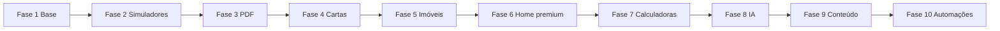

# Plano de Execução por Fases

## Projeto Gauchinho Escritório de Soluções Financeiras

Documento de roadmap: ordem de implementação, entregas e resultados esperados por fase.

**Referência técnica:** [PROJETO-GAUCHINHO-FASE-1.md](./PROJETO-GAUCHINHO-FASE-1.md)

**Stack (Fase 1+):** Next.js (Vercel) + Supabase (Postgres, Auth, Storage, RLS). Migrations em `supabase/migrations/`. Clientes em `src/lib/supabase/`. Perfis em `usuarios.auth_user_id`.

---

## Visão geral da prioridade

A prioridade do projeto deve ser construir primeiro a **base comercial e administrativa**, antes de investir pesado na home premium.

A lógica é:

1. Primeiro criar a estrutura que grava dados, leads, propostas, grupos e configurações.
2. Depois criar os simuladores e cálculos.
3. Depois criar as páginas públicas premium.
4. Depois entrar com IA, conteúdos, cartas contempladas, imobiliárias e refinamentos.

O projeto **não** deve começar apenas pelo visual da home, porque o coração comercial está no simulador, nos grupos, nos leads e nas propostas.

---

# Fase 1 — Fundação do sistema, admin, leads e grupos

## Objetivo

Criar a base estrutural do projeto.

Essa fase cria o “esqueleto inteligente” do sistema:

* Autenticação
* Perfis de usuário
* Painel administrativo
* Configurações gerais
* Dashboard inicial
* Leads
* Propostas básicas
* Módulo de grupos e cotas
* Página pública `/grupos`

## Entregas

### Estrutura base

* Organizar rotas públicas e administrativas.
* Criar layout base do admin.
* Criar autenticação.
* Criar perfis:
  * Master
  * SRD
  * Imobiliária, preparado para uso futuro

### Admin

* Dashboard com cards e tabelas rápidas.
* Configurações Gerais com abas.
* Tela de usuários.
* Tela de leads.
* Tela de propostas, estrutura inicial.
* Tela de grupos.

### Leads

* Cadastro manual.
* Listagem.
* Filtros.
* Detalhe do lead.
* Histórico.
* Agendamento de retorno.
* Fechamento com valor fechado.
* Motivo de perda.
* SRD responsável.

### Grupos e cotas

* CRUD de grupos.
* Um grupo pode ter várias cotas/créditos.
* Cadastro rápido de cotas.
* Página pública `/grupos`.
* Seleção de uma cota por grupo.
* Totalizadores.
* Salvamento da simulação de grupos.

### Banco de dados

Criar as tabelas principais:

* usuarios
* leads
* leads_historico
* propostas
* grupos_consorcio
* grupos_cotas
* simulacoes_grupos
* simulacoes_grupos_itens
* whatsapp_origens
* eventos_site

### Infra (bootstrap Fase 1.1)

* Projeto Supabase + `001_initial_schema.sql` (inclui `configuracoes_sistema`).
* Seed: usuário **Supabase Auth** + linha em `usuarios` (Master).
* `.env.example` e README (Supabase CLI + Vercel).

## Resultado esperado da Fase 1

Ao final da Fase 1, o sistema já deve permitir:

* Entrar no admin.
* Criar usuários.
* Gerenciar leads.
* Criar lead manual.
* Agendar retorno.
* Marcar lead como fechado.
* Registrar valor fechado.
* Cadastrar grupos.
* Cadastrar várias cotas dentro de um grupo.
* Acessar `/grupos`.
* Selecionar cotas.
* Ver totalizadores.
* Salvar simulação de grupos.
* Ter estrutura pronta para proposta PDF nas fases seguintes.

## Critérios de conclusão (checklist)

- [ ] Auth + perfis operacionais
- [ ] Admin com menu e placeholders futuros
- [ ] Configurações (Site, Contato, Propostas, Leads, WhatsApp por origem)
- [ ] Dashboard cards + 3 tabelas rápidas
- [ ] Leads end-to-end (histórico, retorno, fechamento)
- [ ] Propostas CRUD + vínculo lead
- [ ] Grupos + cotas (bulk paste) + duplicar
- [ ] `/grupos` pública + simulação persistida
- [ ] `lib/grupos/calculos.ts` isolado (validação Excel pendente)

---

# Fase 2 — Simuladores principais e cálculos financeiros

## Objetivo

Criar os simuladores que serão o coração comercial do site.

## Entregas

### Simulador de consórcio

* Valor do crédito.
* Prazo.
* Taxa administrativa.
* Fundo de reserva.
* Seguro prestamista.
* Lance embutido.
* Entrada/recurso próprio.
* Parcela estimada.
* Valor total.
* Comparativo com financiamento.
* Projeção de ganho patrimonial.

### Projeção ano a ano

* Tabela ano a ano até o final do prazo.
* Botão “Ver projeção completa”.
* Total pago.
* Crédito reajustado.
* Valorização acumulada.
* Ganho patrimonial estimado.
* Aviso legal.

### Simulador de financiamento

* Valor do bem.
* Entrada.
* Valor financiado.
* Taxa mensal.
* Prazo.
* Parcela estimada.
* Total pago.
* Juros totais.
* Comparativo com consórcio.

### Configurações do simulador

No admin (aba Simulador / Financiamento):

* Taxas por tipo de bem.
* Fundo de reserva por tipo.
* Seguro por tipo.
* Reajuste anual do crédito.
* Correção anual da parcela.
* Prazos disponíveis.
* Valor mínimo/máximo.
* Tipo padrão.

## Resultado esperado da Fase 2

O sistema já conseguirá simular consórcio e financiamento com regras configuráveis.

## Dependências

* Fase 1 concluída (config, leads, eventos, propostas estrutura).

---

# Fase 3 — Proposta PDF premium

## Objetivo

Criar a geração de proposta comercial premium.

## Entregas

### Proposta

* Visitante pode gerar proposta após preencher nome e WhatsApp.
* Sistema grava lead.
* Sistema grava proposta.
* Gera PDF premium.
* Mostra opção de baixar/imprimir.

### Conteúdo da proposta

* Logo do Gauchinho.
* Logo do parceiro, configurável.
* Dados do cliente.
* Dados do consultor, se preenchido.
* Caso contrário, dados gerais do Gauchinho.
* Resumo executivo.
* Cards principais.
* Simulação.
* Comparativo.
* Resumo estratégico da programação financeira:
  * 1 ano
  * 3 anos
  * 5 anos
  * 10 anos
  * Final do prazo
* Seção **Grupos e cotas selecionados** (quando aplicável).
* Validade configurável.
* Aviso legal.

### Admin de propostas

* Lista de propostas.
* Status.
* Visualização.
* Baixar PDF.
* Vínculo com lead.
* Consultor.
* Parceiro.
* Valor do crédito.

## Resultado esperado da Fase 3

O site passa a gerar proposta comercial automática com alto valor percebido.

## Dependências

* Fase 2 (dados de simulação e comparativos).
* Fase 1 (`propostas.pdf_url`, config aba Propostas).

---

# Fase 4 — Cartas contempladas

## Objetivo

Criar a área completa de cartas contempladas.

## Entregas

### Admin

* Cadastro manual.
* Cadastro por texto colado do WhatsApp.
* Organização automática dos campos.
* Revisão antes de salvar.
* Status rápido:
  * Disponível
  * Consultar disponibilidade
  * Em negociação
  * Reservada
  * Vendida
  * Indisponível
  * Inativa

### Página pública

* Cards bonitos.
* Sem foto.
* Dados financeiros organizados.
* Tipo: Imóvel ou Automóvel.
* Administradora.
* Crédito.
* Entrada.
* Parcela.
* Saldo devedor.
* Próxima parcela.
* Taxa de transferência.
* Botão “Tenho interesse”.
* Sempre mostrar “Consulte disponibilidade”.

### Leads

* Nome e WhatsApp.
* Grava lead.
* Vincula carta (`carta_contemplada_id`).
* Mostra botão WhatsApp após cadastro conforme configuração.

## Resultado esperado da Fase 4

O site terá uma vitrine comercial de cartas contempladas com captação de leads.

---

# Fase 5 — Oportunidades imobiliárias e login de imobiliárias

## Objetivo

Criar a vitrine de imóveis e área das imobiliárias parceiras.

## Entregas

### Admin Master

* Cadastro de imobiliárias.
* Criação de login da imobiliária.
* Logo.
* Banner.
* WhatsApp.
* Site.
* Instagram.
* Cidade.
* Status.

### Login da imobiliária

* Editar dados próprios.
* Cadastrar imóveis.
* Editar imóveis.
* Inativar imóveis.
* Marcar vendido/reservado.
* Uma foto principal.
* Valor público ou sob consulta.
* WhatsApp próprio.

### Página pública

* Oportunidades imobiliárias.
* Página da imobiliária.
* Cards de imóveis.
* Filtros.
* Botão “Tenho interesse”.
* Se valor oculto, direciona para WhatsApp da imobiliária após cadastro.
* Se valor público, pode simular compra.

## Resultado esperado da Fase 5

Imobiliárias conseguem alimentar o site e receber contatos, enquanto o Gauchinho mantém os leads registrados.

## Dependências

* Fase 1 (perfil `imobiliaria`, `imobiliaria_id` em usuários e leads).

---

# Fase 6 — Home premium e páginas públicas principais

## Objetivo

Construir o site público com aparência premium de agência.

## Entregas

### Home

Ordem aprovada:

1. Hero premium — “Qual sonho você quer realizar?”
2. Cards grandes com imagens
3. Simulador rápido
4. Quem somos
5. Nossas soluções
6. Oportunidades imobiliárias, se ativado
7. Cartas contempladas em destaque, se ativado
8. Casos de sucesso
9. Dicas do Tchê
10. Parceiros
11. Contato / agendar consultoria

### Visual

* Paleta atual do site.
* Visual escuro/dourado premium.
* Cards grandes.
* Imagens fortes.
* Microinterações.
* Efeitos elegantes.
* Não parecer site feito por IA.

### Páginas

* Consórcio
* Financiamento
* Cartas contempladas
* Oportunidades imobiliárias
* Simulador
* Calculadoras
* Casos de sucesso
* Dicas do Tchê
* Contato

## Resultado esperado da Fase 6

O site público fica bonito, forte, premium e pronto para tráfego.

## Nota de prioridade

Esta fase vem **depois** da base (Fases 1–5) de propósito: tráfego e conversão apoiados em simuladores, propostas, cartas e imóveis já funcionais.

---

# Fase 7 — Calculadoras financeiras

## Objetivo

Criar as calculadoras estilo “calculadora do cidadão”, mas com foco comercial.

## Calculadoras

* Aplicação mensal
* Financiamento
* Valor futuro
* Correção de valores

## Fluxo

* Mostra resultado simples na tela.
* Oferece análise completa com IA.
* Pede nome e WhatsApp.
* Grava lead.
* Mostra análise.
* Pode exibir botão WhatsApp por origem.

## Resultado esperado da Fase 7

O site passa a captar leads também por ferramentas educativas.

---

# Fase 8 — IA do site

## Objetivo

Criar chat com IA em todas as páginas.

## Entregas

* IA em todas as páginas.
* Base de informação configurável no admin.
* Triagem comercial.
* Captura de nome e WhatsApp.
* Gravação de lead com tag `lead_ia`.
* Resumo da conversa.
* Regras do que pode e não pode prometer.

## Primeira versão da IA

Usar apenas informações cadastradas no admin.

Não buscar automaticamente imóveis, cartas ou dados dinâmicos nesta fase.

## Resultado esperado da Fase 8

O chat deixa de ser apenas tira-dúvidas e vira pré-atendimento comercial.

---

# Fase 9 — Conteúdo, prova social e refinamentos

## Objetivo

Finalizar áreas de conteúdo e confiança.

## Entregas

### Casos de sucesso

* Foto
* Vídeo
* Texto
* 5 estrelas visuais
* Destaque na home

### Dicas do Tchê

* Blog manual
* Imagem
* Vídeo
* Texto
* Botão Saiba Mais

### Parceiros

* Logos
* Links
* Exibição na home
* Exibição em propostas

### Refinamentos

* SEO
* Compartilhamento
* Performance
* Mobile
* Ajustes visuais
* Melhorias de dashboard

## Resultado esperado da Fase 9

Site completo em conteúdo, confiança e polish operacional.

---

# Fase 10 — Automações futuras

## Objetivo

Preparar evoluções após o sistema estar rodando.

Possibilidades:

* Integração com WhatsApp oficial.
* Distribuição automática de leads.
* Notificações para SRD.
* Painel de leads para imobiliárias.
* Relatórios gráficos.
* Exportação de propostas.
* Mais automações com IA.
* Busca dinâmica da IA em cartas e imóveis ativos.

## Resultado esperado da Fase 10

Operação escalável com menos trabalho manual e melhor resposta comercial.

---

## Resumo executivo por fase

| Fase | Foco | Valor de negócio |
|------|------|------------------|
| 1 | Admin, leads, grupos, `/grupos` | Operação e captação via grupos |
| 2 | Simuladores consórcio/financiamento | Coração comercial |
| 3 | PDF premium | Proposta de alto impacto |
| 4 | Cartas contempladas | Vitrine + leads |
| 5 | Imobiliárias e imóveis | Parceiros + vitrine |
| 6 | Home e páginas premium | Marca e tráfego |
| 7 | Calculadoras | Leads educativos |
| 8 | IA chat | Pré-atendimento |
| 9 | Conteúdo e SEO | Confiança |
| 10 | Automações | Escala |

---

*Atualizar este plano quando uma fase for concluída ou quando escopo/datas mudarem.*
