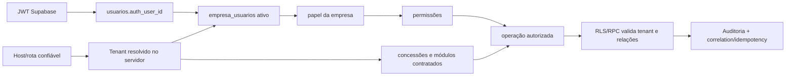
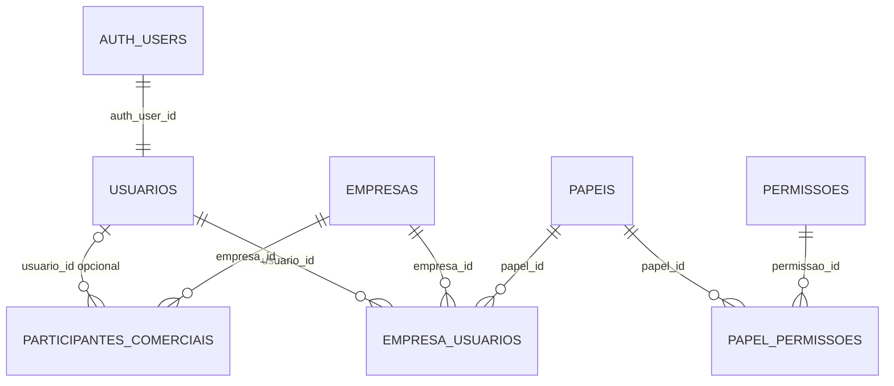
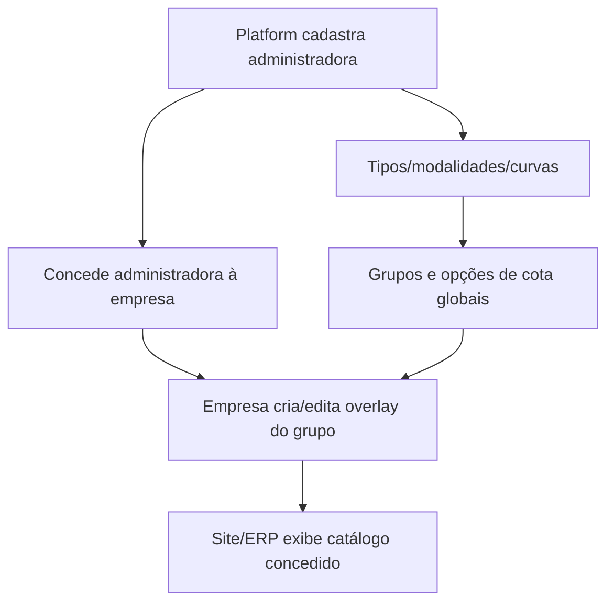
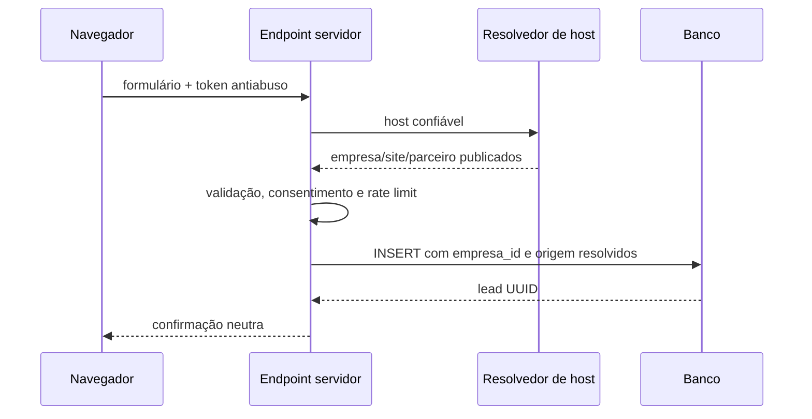

# SAAS GAUCHINHO — ARQUITETURA-ALVO, CONTRATO DE DADOS E PLANO DE CORREÇÃO

> **Versão:** 1.0.0
>
> **Data:** 25/08/2026
>
> **Status:** especificação normativa do estado-alvo e plano de remediação; **não significa que todas as correções descritas já estejam implantadas**.
>
> **Escopo:** somente o repositório `GAUCHINHO SITE`, seus sites, Platform, ERPs, Supabase e integrações relacionadas.
>
> **Documento-base obrigatório:** [`SAAS-MASTER-ARCHITECTURE.md`](./SAAS-MASTER-ARCHITECTURE.md).
>
> **Preservação:** nenhum ajuste poderá apagar, sobrescrever ou recalcular silenciosamente os dados históricos da Gauchinho Consórcios ou de qualquer futuro tenant.

---

## 1. Finalidade e como usar este documento

Este documento define como o SaaS deverá funcionar depois do hardening necessário para operar com várias administradoras, franquias, parceiros, sites e ERPs em grande escala. Ele também traduz a auditoria técnica e a resposta do agente que desenvolveu o sistema em decisões de arquitetura executáveis.

Ele deve ser usado para cinco finalidades:

1. orientar as correções sem transformar a remediação em uma reescrita arriscada;
2. impedir que novos recursos reintroduzam UUIDs soltos, consultas sem tenant ou privilégios excessivos;
3. explicar o significado das entidades, IDs, vínculos e percentuais financeiros;
4. definir a sequência de migrations, código, testes, homologação e rollout;
5. servir como contrato técnico para qualquer novo agente ou desenvolvedor.

### 1.1 Hierarquia de autoridade documental

Quando houver divergência, usar esta ordem:

1. regras de preservação e escopo do `AGENTS.md`;
2. este documento para o **estado-alvo** e a ordem das correções;
3. `SAAS-MASTER-ARCHITECTURE.md` para o histórico e a arquitetura oficial já documentada;
4. migrations efetivamente aplicadas ao banco correto;
5. schema real do banco correto;
6. código da aplicação;
7. relatórios de fases e documentos auxiliares.

Migrations locais, documentação e banco remoto podem estar divergentes. Portanto, uma afirmação sobre o estado de produção só é válida depois de conferir o projeto Supabase correto, o histórico remoto e o schema real. Nunca usar apenas o número do último arquivo local como prova de implantação.

### 1.2 O que este documento não autoriza

Este documento não autoriza automaticamente:

- aplicar migrations;
- recalcular comissões históricas;
- excluir tabelas, funções, usuários, arquivos ou tenants;
- promover Preview para Produção;
- alterar regras comerciais homologadas;
- usar `service_role` para contornar RLS;
- realizar backfill sem relatório de impacto e plano de reversão.

Cada onda de correção deverá ser autorizada, implementada, testada e documentada separadamente.

---

## 2. Síntese executiva da auditoria e da resposta recebida

A resposta do agente desenvolvedor confirma que a direção funcional do produto é válida, mas reconhece que o perímetro de isolamento precisa ser fechado antes da expansão externa.

### 2.1 Decisões de negócio confirmadas

1. **Catálogo global canônico:** administradoras, tipos, modalidades, curvas, grupos e opções de cota pertencem à Platform/administradora. Franquias não duplicam nem alteram o catálogo oficial.
2. **Concessão por tenant:** cada empresa só utiliza administradoras concedidas em `empresa_administradoras` e grupos apresentados/configurados em `empresa_grupos_config`.
3. **Comissão híbrida:** a base comercial da franquia é homologada pela Platform/administradora em programas versionados; a empresa controla o rateio entre seus participantes dentro dos limites do contrato.
4. **Tenant por contexto:** domínio ou subdomínio determina a empresa acessada. Em um futuro host central neutro, um seletor explícito poderá gerar cookie assinado, mas o cookie será apenas uma seleção verificável — nunca autorização autônoma.
5. **Papéis por empresa:** o papel efetivo vem de `empresa_usuarios.papel_id`; `usuarios.perfil` é legado e deverá ser descontinuado para autorização.
6. **Funil público tenant-aware:** lead, proposta, contratação e venda originados por sites da empresa ou de parceiros devem nascer com `empresa_id` e origem rastreável.
7. **Entidades locais:** imobiliárias, seguradoras/corretoras, parceiros e eventos operacionais pertencem ao tenant e devem ter `empresa_id`.

### 2.2 Regras Racon/Gauchinho confirmadas, mas não universais

Os percentuais e curvas já cadastrados para Racon/Gauchinho podem representar regras oficiais homologadas desse contrato. Eles não devem ser removidos ou reinterpretados sem conferência comercial. Porém:

- `4%` não pode ser fallback silencioso para outra administradora, outro tenant, outro tipo ou outra modalidade;
- `68,75% / 31,25%` pode ser um rateio válido da Gauchinho, mas não pode virar default global;
- ausência de regra aplicável deve bloquear o cálculo e abrir pendência operacional, não inventar uma regra;
- alterações futuras exigem nova versão com vigência, nunca edição retroativa de versão já utilizada.

### 2.3 Pontos de concordância técnica

A auditoria e a resposta recebida convergem nos seguintes itens prioritários:

- fechar `SECURITY DEFINER` para `PUBLIC` e `anon` e exigir identidade/autorização dentro da função;
- impedir que `service_role` transforme uma rota sem autorização em acesso irrestrito;
- resolver tenant por host e vínculo ativo, sem `vinculos[0]` nem fallback para Gauchinho;
- incluir `empresa_id` em toda escrita pública e validar sua origem no servidor;
- tornar caminhos do Storage tenant-aware;
- impedir formalização local de mutar catálogo global;
- normalizar etapas de comissão atomicamente;
- reconciliar migrations duplicadas e projetos Supabase antes de qualquer deploy;
- abandonar `usuarios.perfil` como fonte de verdade multiempresa.

---

## 3. Estado observado versus estado-alvo

### 3.1 Estado observado no repositório em 25/08/2026

- a fundação multiempresa existe (`empresas`, `empresa_usuarios`, `papeis`, `permissoes`, domínios e branding);
- existem helpers canônicos de identidade e autorização na migration 057;
- catálogo global e concessão de administradoras existem;
- comissões, previsões, financeiro, caixa, estornos e idempotência possuem boa base transacional nas migrations 061–063;
- há testes automatizados relevantes: na auditoria, 926 passaram e 37 estavam pulados;
- a checagem TypeScript sem emissão passou;
- o lint ainda apresentava 93 erros e 167 avisos;
- existem duas migrations locais numeradas `101`;
- o projeto Supabase vinculado pela CLI durante a auditoria não correspondia inequivocamente ao projeto indicado pela configuração da aplicação;
- o histórico remoto observado pela CLI terminava antes das migrations locais mais recentes;
- há rotas/actions, RPCs e políticas com falhas de tenant, privilégio ou compatibilidade legado.

Esses fatos descrevem o repositório e a sessão auditada, não constituem prova do estado atual de Produção.

### 3.2 Estado-alvo resumido

O sistema corrigido deverá obedecer ao fluxo de confiança abaixo:



Nenhuma camada isolada é suficiente. Ocultar menu não autoriza, middleware não substitui RLS, RLS não corrige RPC privilegiada insegura e `service_role` não substitui validação de negócio.

---

## 4. Invariantes não negociáveis

Todo código novo ou corrigido deverá preservar estes invariantes:

1. Nenhuma linha tenant-scoped é lida ou alterada sem `empresa_id` resolvido e validado.
2. Nenhum UUID recebido do cliente é confiável por si só.
3. `auth.uid()` identifica `auth.users`, não `public.usuarios`, participante comercial ou consultor.
4. Um usuário pode ter papéis diferentes em empresas diferentes.
5. O host determina o tenant em hosts tenantizados; o cliente não escolhe livremente `empresa_id`.
6. O Platform Host não possui fallback de tenant e não pode virar ERP de uma empresa por acidente.
7. Catálogo global só é alterado pela Platform com permissão específica.
8. Tenant só enxerga catálogo concedido e só altera overlay/localização permitida.
9. Regra financeira usada gera snapshot imutável; edição posterior não altera o passado.
10. Dinheiro usa `numeric`, arredondamento explícito e reconciliação; nunca `float` JavaScript como fonte final.
11. Caixa, auditoria, recebimentos confirmados e estornos são append-only ou compensados por novos eventos.
12. Operações financeiras críticas são idempotentes, transacionais e bloqueadas contra concorrência.
13. `service_role` é segredo exclusivo do servidor e não concede autorização de usuário.
14. Toda RPC `SECURITY DEFINER` tem privilégios explícitos, `search_path` seguro e checagem interna.
15. Nenhum fallback comercial cria programa, percentual, grupo ou cota para “fazer funcionar”.
16. Nenhum ID de tenant real fica hardcoded em fluxo de produção.
17. Toda correção de schema é forward-only e compatível com dados existentes.
18. A empresa Gauchinho é o primeiro tenant, não uma exceção arquitetural invisível.

---

## 5. Contextos do produto e fronteiras de confiança

### 5.1 Platform

Responsável pela governança global:

- tenants, planos, assinaturas, quotas e módulos;
- catálogo de administradoras;
- tipos, modalidades, curvas, modelos de comissão, grupos e cotas oficiais;
- concessões `empresa_administradoras`;
- programas-base e versões homologadas;
- auditoria global e suporte controlado.

Platform Superadmin não deve ser representado apenas por e-mail, metadata do cliente ou `usuarios.perfil`. A autorização exige vínculo/papel de escopo `PLATFORM` validado no banco.

### 5.2 ERP da empresa/franquia

Responsável pela operação local:

- usuários e papéis da própria empresa;
- participantes comerciais;
- parceiros e organizações;
- CRM, leads, propostas, contratações e vendas;
- overlays de apresentação de grupos;
- rateios de comissão permitidos;
- previsões, recebimentos, repasses, contas e caixa;
- branding, sites e módulos contratados.

O ERP nunca deve alterar um catálogo global para concluir uma formalização local.

### 5.3 Site público da empresa

É resolvido por domínio/subdomínio verificado. Só recebe conteúdo publicado e dados públicos autorizados. Escritas públicas entram por endpoint servidor validado, com rate limit, proteção antiabuso, consentimento e atribuição de origem.

### 5.4 Site de parceiro

É um canal subordinado a uma empresa e a uma `organizacao_parceira`. Seu host ou rota resolve simultaneamente:

- `empresa_id` proprietária;
- `parceiro_site_id`;
- `organizacao_parceira_id`;
- branding/template publicado;
- participante responsável, quando configurado e válido.

Nenhum desses IDs deve ser aceito do navegador sem cruzamento com a resolução do servidor.

### 5.5 Integrações e jobs

Webhooks, importações, conciliações e jobs agendados precisam de identidade de sistema, segredo próprio, escopo de tenant e idempotência. Um job global deve iterar tenants explicitamente e registrar cada unidade de trabalho; nunca executar `UPDATE` global porque usa `service_role`.

---

## 6. Classificação canônica dos dados

Antes de criar ou alterar uma tabela, classificar a entidade em uma das categorias abaixo.

| Categoria | Propriedade | Exemplos | Regra principal |
|---|---|---|---|
| Identidade global | Plataforma | `auth.users`, `usuarios` | Identidade não implica vínculo com empresa |
| Governança global | Plataforma | `empresas`, planos, assinaturas, quotas | Escrita Platform; leitura conforme capacidade |
| Catálogo global | Plataforma/administradora | `administradoras`, tipos, modalidades, curvas, `grupos_consorcio`, `grupos_cotas` | Tenant não muta atributos canônicos |
| Concessão/overlay | Plataforma + tenant limitado | `empresa_administradoras`, `empresa_grupos_config` | Concessão define acesso; overlay não reescreve catálogo |
| Tenant-scoped | Empresa | leads, propostas, vendas, participantes, parceiros, financeiro | `empresa_id NOT NULL`, RLS e integridade relacional |
| Fato histórico | Empresa, imutável | snapshots de venda/comissão, caixa, auditoria, estorno | Não recalcular/editar silenciosamente |
| Conteúdo público | Empresa/parceiro | branding, páginas, menus publicados | Resolução por host e estado publicado |
| Segredo | Plataforma/empresa | chaves de integração | Vault/secret manager; nunca JSON público ou log |

### 6.1 Catálogo global

Pertencem ao catálogo global, salvo decisão explícita em contrário:

- `administradoras`;
- `administradora_tipos`;
- `administradora_modalidades_comissao`;
- `administradora_curvas_estorno` e faixas;
- `administradora_modelos_comissao` e modalidades vinculadas;
- `grupos_consorcio`;
- `grupos_cotas` e estruturas oficiais correlatas;
- catálogo de tipos de participante;
- catálogo de permissões.

### 6.2 Dados tenant-scoped

Devem possuir `empresa_id NOT NULL`, índices apropriados e validação de pertencimento:

- `empresa_usuarios` e papéis locais;
- `participantes_comerciais`, organizações e sites parceiros;
- leads, propostas, contratações e vendas;
- cotas definitivas adquiridas;
- rateios e participantes da venda;
- programas atribuídos ao tenant e suas regras contratuais;
- previsões de comissão;
- recebimentos, pagamentos, repasses, contas e caixa;
- metas, tarefas, agenda e eventos locais;
- imobiliárias, corretoras/seguradoras e demais parceiros locais;
- arquivos privados e metadados operacionais.

### 6.3 Global com concessão e overlay local

O padrão adotado é:

```text
administradora global
  └── empresa_administradoras: concessão empresa × administradora
        └── grupos globais da administradora
              └── empresa_grupos_config: visibilidade e apresentação local
```

Por decisão confirmada, não será criada imediatamente uma terceira tabela `empresa_grupo_concessoes`. Primeiro serão endurecidas as tabelas existentes. Uma nova tabela só será proposta se ficar comprovado que `empresa_administradoras` + `empresa_grupos_config` não conseguem distinguir concessão, disponibilidade e apresentação sem ambiguidade.

Campos locais aceitáveis no overlay incluem:

- visibilidade;
- destaque e ordem;
- título e descrição comercial;
- conteúdo/SEO local;
- disponibilidade local dentro da concessão;
- parâmetros comerciais explicitamente liberados pela Platform.

Campos que permanecem globais incluem identidade da administradora, número oficial do grupo, prazo, bem/referência, modalidade canônica e faixas oficiais de cota.

### 6.4 Mapa lógico do banco por domínio

O inventário abaixo foi consolidado a partir das migrations locais. Ele orienta o estado-alvo, mas a existência, coluna e policy de cada objeto precisam ser confirmadas no banco de destino antes de uma mudança.

#### Fundação e identidade

| Tabelas | Função | Escopo-alvo |
|---|---|---|
| `usuarios` | Identidade interna ligada a `auth.users` | Global; sem papel global de tenant |
| `empresas` | Registro raiz do tenant | Governança Platform |
| `empresa_usuarios` | Vínculo N:N usuário × empresa × papel | Tenant |
| `papeis` | Papéis de escopo Platform ou Company | Global ou tenant conforme `escopo/empresa_id` |
| `permissoes` | Catálogo de capacidades | Global |
| `papel_permissoes` | Capacidades atribuídas a papéis | Conforme escopo do papel |
| `configuracoes_sistema` | Configurações legadas/gerais | Deve ser classificada e tenantizada por chave; não autorizar implicitamente |

#### Platform, planos e assinatura

| Tabelas | Função | Escopo-alvo |
|---|---|---|
| `saas_planos` | Catálogo de planos | Platform |
| `erp_modulos_catalogo` | Catálogo de módulos | Platform |
| `saas_plano_modulos` | Módulos incluídos no plano | Platform |
| `saas_assinaturas` | Contrato do tenant | Tenant governado pela Platform |
| `saas_empresa_overrides` | Exceções explícitas do contrato | Tenant governado/auditado pela Platform |
| `plataforma_configuracoes` | Configuração global | Platform |
| `plataforma_auditoria` | Trilha de ações globais | Platform append-only |

`empresas.configuracoes` e JSONs de assinatura não devem virar depósito de autorização sem schema. Campos que governam acesso, preço, quota ou obrigação financeira devem ser normalizados ou validados por schema e versionamento.

#### Domínios, branding e publicação

| Tabelas | Função | Escopo-alvo |
|---|---|---|
| `empresa_dominios` | Host da empresa | Tenant, governado e verificado |
| `empresa_branding` | Identidade visual/publicação principal | Tenant |
| `site_modelos` | Catálogo de templates e versões | Platform |
| `empresa_site_modelos` | Modelo configurado/contratado pela empresa | Tenant |
| `parceiro_sites` | Site de organização parceira | Tenant |
| `parceiro_site_dominios` | Host do site parceiro | Tenant e unicidade global de host |
| `parceiro_site_auditoria` | Histórico de publicação/domínio | Tenant append-only |

#### Catálogo de consórcios

| Tabelas | Função | Escopo-alvo |
|---|---|---|
| `administradoras` | Administradora canônica | Global |
| `empresa_administradoras` | Concessão empresa × administradora | Tenant, escrita Platform |
| `administradora_tipos`, `administradora_tipo_aliases` | Tipos e aliases canônicos | Global por administradora |
| `administradora_modalidades_comissao` | Modalidades canônicas | Global por administradora |
| `administradora_modalidade_tipos` | Compatibilidade modalidade × tipo | Global |
| `administradora_curvas_estorno` e `administradora_curva_estorno_faixas` | Curvas versionadas | Global por administradora |
| `administradora_curva_tipos`, `administradora_curva_modalidades` | Compatibilidade de curva | Global |
| `administradora_modelos_comissao`, `administradora_modelo_modalidades` | Modelos master | Global, Platform |
| `grupos_consorcio` | Grupo oficial | Global por administradora |
| `grupos_cotas` | Opções/faixas oficiais do grupo | Global, filha do grupo |
| `grupos_modalidades_disponiveis`, `grupo_cota_modalidade_valores` | Compatibilidade e valores por modalidade | Global |
| `empresa_grupos_config` | Overlay/apresentação da empresa | Tenant |
| `grupos_governanca_historico`, `grupos_vinculacoes_legadas_historico` | Trilha de manutenção/reconciliação | Global/tenant conforme origem, append-only |
| `grupo_estatisticas_historico`, `grupos_sorteios_loteria`, `grupos_modalidades_lance` | Dados históricos/operacionais do grupo | Classificar origem global vs tenant antes de alterar |

#### CRM e jornada do cliente

| Tabelas | Função | Escopo-alvo |
|---|---|---|
| `leads`, `leads_historico`, `lead_atividades` | Captação e evolução do lead | Tenant |
| `propostas`, `propostas_documentos` | Simulação/proposta e documentos | Tenant |
| `contratacoes_online`, `contratacoes_documentos` | Aceite/contratação | Tenant |
| `contratacoes_formalizacao_historico` | Histórico de formalização | Tenant append-only |
| `clientes`, `clientes_historico` | Cadastro operacional do cliente | Tenant |
| `simulacoes_grupos`, `simulacoes_grupos_itens` | Simulações compartilháveis | Tenant/origem pública rastreável |
| `whatsapp_origens` | Atribuição de origem/canal | Tenant |

Relação canônica:

```text
empresa/site/parceiro
  → lead
    → proposta
      → contratação
        → venda
          → cota definitiva
```

Cada transição preserva `empresa_id`, IDs de origem e snapshots. Nem toda lead chega a proposta e nem toda proposta chega a contratação; os estados intermediários são válidos e não devem criar fatos financeiros antecipadamente.

#### Participantes, parceiros e operação comercial

| Tabelas | Função | Escopo-alvo |
|---|---|---|
| `participante_tipo_catalogo` | Tipos de atuação | Global |
| `participantes_comerciais` | Perfil operacional | Tenant |
| `participante_tipos` | Atuações do participante | Tenant, mesmo participante |
| `participante_auditoria` | Trilha do participante | Tenant append-only |
| `organizacoes_parceiras` | Imobiliária, corretora, parceiro etc. | Tenant |
| `participante_organizacoes` | Vínculo participante × organização | Tenant em ambos os lados |
| `microfranquia_participantes_comissao` | Rateio local vigente | Tenant |
| `venda_participantes` | Participantes fixados no fato venda | Tenant/snapshot |
| `parceiros`, `imobiliarias`, `seguradoras` | Estruturas legadas/específicas | Devem ser reconciliadas com organização tenant-scoped |

Não consolidar tabelas legadas por exclusão direta. Primeiro mapear dependências e decidir se passam a referenciar `organizacoes_parceiras`, permanecem como especialização ou são apenas compatibilidade de leitura.

#### Vendas, cotas e estratégia

| Tabelas | Função | Escopo-alvo |
|---|---|---|
| `vendas` | Fato comercial fechado | Tenant |
| `cotas_definitivas` | Cota efetivamente adquirida | Tenant, filha da venda |
| `cota_contemplacoes` | Eventos de contemplação | Tenant append-only |
| `cota_estrategias_lance`, `cota_estrategias_lance_historico` | Estratégia e histórico de lance | Tenant |
| `cartas_contempladas` | Oferta/operação de carta contemplada | Classificar cuidadosamente origem e propriedade |
| `erp_assembleias_grupo`, `erp_assembleia_atencoes` | Operação de assembleias/atenções | Tenant, sem mutar sorteio oficial |

#### Comissões

| Tabelas | Função | Escopo-alvo |
|---|---|---|
| `comissao_programas` | Programa contratual atribuído à empresa | Tenant, governança Platform |
| `comissao_regras_franquia` | Regra-base versionada | Tenant, homologação Platform |
| `comissao_regra_etapas` | Cronograma normalizado | Filha da regra |
| `comissao_regras_participantes` | Regra de distribuição local | Tenant |
| `comissao_previsoes_franquia` | Recebível previsto da empresa | Tenant/fato |
| `comissao_previsoes_participantes` | Repasse previsto | Tenant/fato |
| `empresa_configuracoes_fiscais` | Imposto vigente | Tenant/versionado |

#### Financeiro e caixa

| Tabelas | Função | Escopo-alvo |
|---|---|---|
| `financeiro_recebimentos`, `financeiro_recebimento_itens` | Entrada e alocação por previsão | Tenant |
| `financeiro_recebimento_classificacoes`, `financeiro_recebimento_conciliacoes` | Classificação/conciliação | Tenant |
| `financeiro_pagamentos`, `financeiro_pagamento_itens` | Saída/repasse e itens | Tenant |
| `financeiro_compensacoes`, `financeiro_compensacao_movimentos` | Crédito/consumo compensatório | Tenant append-only |
| `financeiro_estornos`, `financeiro_estornos_curva` | Estornos | Tenant append-only |
| `financeiro_pendencias_recebimento`, `financeiro_pendencia_movimentos` | Pendências e tratamento | Tenant append-only por movimento |
| `financeiro_divergencias_recebimento` | Diferença de valor | Tenant |
| `financeiro_contas_bancarias` | Contas autorizadas | Tenant, dados protegidos |
| `financeiro_centros_custo` | Classificação local | Tenant |
| `financeiro_contas_pagar`, `financeiro_contas_pagar_logs` | Obrigações e governança | Tenant; logs append-only |
| `caixa_movimentos` | Livro de caixa | Tenant append-only |
| `operacoes_idempotentes` | Deduplicação transacional | Tenant/operação |
| `erp_solicitacoes_repasse`, pedidos e histórico | Solicitação operacional de repasse | Tenant |

Relação financeira principal:

```text
venda + snapshot da regra
  → previsões da franquia
    → recebimento + itens
      → caixa de entrada
      → elegibilidade proporcional de repasse
        → pagamento + itens
          → caixa de saída

cancelamento/divergência
  → compensação, pendência ou estorno append-only
```

#### Gestão, agenda, conteúdo e integrações

| Tabelas | Função | Escopo-alvo |
|---|---|---|
| `equipes`, `equipe_membros` | Estrutura comercial | Tenant |
| `metas_comerciais` | Metas sem realizado fixo | Tenant |
| `tarefas_gestao` | Tarefas operacionais | Tenant |
| `audit_logs_central` | Auditoria técnica/negócio | Tenant/Platform, append-only |
| `agenda_*` | Disponibilidade, compromissos e bloqueios | Usuário/tenant conforme recurso |
| `eventos*` | Eventos, listas, participantes, posts e sorteios | Tenant; conteúdo público só quando publicado |
| `casos_sucesso`, `depoimentos`, `dicas_tche`, `perguntas_frequentes` | Conteúdo de site | Deve resolver publicação/tenant ou ser explicitamente global |
| `imoveis` | Conteúdo/operação imobiliária | Tenant via organização responsável |
| `ia_conversas`, `ia_mensagens` | Histórico de IA | Tenant/usuário, com retenção e privacidade |
| `usuario_google_calendar_secrets` | Credenciais de calendário | Segredo por usuário/tenant, criptografado |
| `qr_codes_unicos`, `qr_codes_unicos_vinculos` | Identificador/canal de atribuição | Tenant e origem rastreável |

Tabelas antigas de conteúdo, eventos, imóveis, parceiros ou integrações que ainda não possuam `empresa_id` precisam entrar no inventário da Onda 4/5. A regra não é preencher tudo com Gauchinho; é provar origem, separar o que é global e criar pendência para ambiguidades.

---

## 7. Modelo de identidade, usuários, papéis e participantes

### 7.1 Cadeia correta de identidade



Significados:

- `auth.uid()` = `auth.users.id`, identidade da sessão Supabase;
- `usuarios.id` = identidade interna global da pessoa;
- `empresa_usuarios.id` = vínculo da pessoa com uma empresa;
- `papel_id` = papel naquele vínculo/tenant;
- `participantes_comerciais.id` = perfil operacional que pode participar de vendas e comissões;
- uma pessoa autenticada pode não ser participante comercial;
- um participante comercial pode existir antes de possuir login.

### 7.2 Papel por tenant

O papel efetivo é sempre obtido pela combinação:

```text
usuario atual + empresa resolvida + empresa_usuarios ativo + papel ativo
```

`usuarios.perfil` não pode autorizar ações, menus, RPCs, RLS ou gerenciamento de usuários. Durante a transição ele poderá permanecer apenas como dado legado para compatibilidade controlada e telemetria de migração.

### 7.3 Modelo de permissões

Papéis agrupam capacidades; regras sensíveis devem verificar capacidade granular. Conjunto mínimo recomendado:

| Módulo | Capacidades mínimas |
|---|---|
| Tenant | `tenant.visualizar`, `tenant.configurar` |
| Usuários | `usuarios.visualizar`, `usuarios.convidar`, `usuarios.editar`, `usuarios.desativar`, `papeis.atribuir` |
| CRM | `crm.visualizar`, `crm.criar`, `crm.editar`, `crm.excluir` |
| Vendas | `vendas.visualizar`, `vendas.criar`, `vendas.formalizar`, `vendas.cancelar` |
| Catálogo local | `catalogo.visualizar`, `catalogo.configurar_overlay` |
| Comissões | `comissoes.visualizar`, `comissoes.configurar_rateio`, `comissoes.homologar_base` |
| Financeiro | `financeiro.visualizar`, `financeiro.receber`, `financeiro.pagar`, `financeiro.estornar`, `financeiro.conciliar` |
| Sites | `sites.visualizar`, `sites.editar`, `sites.publicar`, `sites.dominios` |
| Platform | `platform.tenants`, `platform.catalogo`, `platform.concessoes`, `platform.comissoes`, `platform.suporte` |

Os códigos reais devem seguir o padrão de nomenclatura já escolhido no banco. Antes de criar novos códigos, reconciliar permissões existentes para evitar sinônimos concorrentes.

### 7.4 Separação entre usuário e participante

Nunca presumir `consultant_id = auth.uid()` ou `participante_comercial_id = usuarios.id`.

Para atribuir uma venda ao participante logado:

1. resolver `usuarios.id` por `auth_user_id`;
2. confirmar vínculo ativo em `empresa_usuarios` para o tenant;
3. localizar participante ativo da mesma empresa com `usuario_id = usuarios.id`;
4. confirmar tipo de atuação exigido;
5. gravar o UUID de `participantes_comerciais`.

Se qualquer etapa falhar, retornar erro de domínio claro; não usar o UUID de outra entidade como fallback.

---

## 8. Contrato de UUIDs e integridade relacional

### 8.1 Regra de ouro

Um UUID só prova que um valor tem formato de UUID. Ele não prova:

- que a linha existe;
- que está ativa;
- que pertence ao tenant;
- que pertence ao pai informado;
- que foi concedida ao tenant;
- que o usuário pode utilizá-la;
- que está vigente;
- que representa o tipo de entidade esperado.

### 8.2 Validação obrigatória em sete camadas

Todo UUID recebido em rota, Server Action ou RPC deve passar por:

1. **tipo:** parse/validação de UUID;
2. **existência:** linha existe na tabela esperada;
3. **tenant:** linha tenant-scoped tem o mesmo `empresa_id`;
4. **parentesco:** filho pertence ao pai informado;
5. **concessão:** entidade global está disponível ao tenant;
6. **estado/vigência:** ativa, publicada, homologada e vigente conforme o fluxo;
7. **capacidade:** ator tem permissão para a operação.

### 8.3 Dicionário dos UUIDs centrais

| Campo/ID | Entidade | Escopo | Validação indispensável |
|---|---|---|---|
| `auth.uid()` | `auth.users.id` | Identidade | Sessão válida |
| `usuario_id` | `usuarios.id` | Global | `auth_user_id` correto ou alvo autorizado |
| `empresa_id` | `empresas.id` | Tenant | Tenant resolvido, ativo e contratado |
| `empresa_usuario_id` | `empresa_usuarios.id` | Tenant | Mesmo tenant e vínculo ativo |
| `papel_id` | `papeis.id` | Global/local | Escopo compatível e papel ativo |
| `participante_comercial_id` | `participantes_comerciais.id` | Tenant | Mesmo tenant, status e tipo de atuação |
| `organizacao_parceira_id` | `organizacoes_parceiras.id` | Tenant | Mesmo tenant e estado válido |
| `parceiro_site_id` | `parceiro_sites.id` | Tenant | Mesmo tenant e mesma organização |
| `administradora_id` | `administradoras.id` | Global | Concessão ativa em `empresa_administradoras` |
| `grupo_id` | `grupos_consorcio.id` | Global | Administradora correta e concedida |
| `grupo_cota_id` | `grupos_cotas.id` | Global | A opção pertence ao grupo escolhido |
| `venda_id` | `vendas.id` | Tenant | Mesmo tenant; lock em operação financeira |
| `cota_definitiva_id` | `cotas_definitivas.id` | Tenant | Mesma venda e mesmo tenant |
| `programa_id` | `comissao_programas.id` | Tenant atribuído | Mesmo tenant/admin, status e vigência |
| `regra_franquia_id` | `comissao_regras_franquia.id` | Tenant/versionado | Pertence ao programa e combinação escolhida |
| `previsao_id` | previsão de comissão | Tenant | Mesma venda/tenant e saldo disponível |

### 8.4 IDs que precisam ser comparados em conjunto

Consultas inseguras:

```sql
select * from public.vendas where id = p_venda_id;
delete from public.contratos where id = p_contrato_id;
update public.participantes_comerciais set status = 'INATIVO' where id = p_id;
```

Padrão mínimo:

```sql
select *
from public.vendas
where id = p_venda_id
  and empresa_id = p_empresa_id
for update;
```

Para tabelas filhas com `empresa_id`, preferir constraints compostas quando viável:

```sql
alter table public.vendas
  add constraint vendas_empresa_id_id_uk unique (empresa_id, id);

alter table public.venda_participantes
  add constraint venda_participantes_venda_mesmo_tenant_fk
  foreign key (empresa_id, venda_id)
  references public.vendas (empresa_id, id)
  on delete restrict;
```

Esse padrão reduz a dependência de triggers. Triggers ainda podem validar regras de estado e tipo, mas a integridade básica deve estar no schema sempre que possível.

### 8.5 Relação grupo × cota

Ao receber `grupo_id` e `grupo_cota_id`, validar atomicamente:

```sql
select gc.*
from public.grupos_cotas gc
join public.grupos_consorcio g on g.id = gc.grupo_id
join public.empresa_administradoras ea
  on ea.administradora_id = g.administradora_id
 and ea.empresa_id = p_empresa_id
 and ea.status = 'ATIVA'
where gc.id = p_grupo_cota_id
  and gc.grupo_id = p_grupo_id
  and g.status = 'ATIVO';
```

Não basta validar grupo e cota em queries independentes; uma cota válida de outro grupo continua sendo uma combinação inválida.

### 8.6 Texto contendo UUID

Campos que representam relações devem ser `uuid` com foreign key, não `text`. Se houver legado textual:

1. adicionar nova coluna UUID nullable;
2. medir válidos, inválidos, órfãos e ambiguidades;
3. preencher apenas vínculos comprováveis;
4. enviar exceções para tabela/fila de pendências;
5. trocar leituras para a nova coluna;
6. tornar `NOT NULL` somente quando não houver órfãos;
7. remover campo antigo em fase posterior, nunca na mesma etapa de expansão.

### 8.7 UUIDs hardcoded

UUID real de tenant só é aceitável em:

- fixture de teste claramente nomeada;
- seed idempotente de migração legado com comentário e escopo exato;
- script de manutenção de uso único, fora do runtime, com confirmação do alvo.

É proibido em páginas, layouts, Server Actions, handlers, helpers de tenant, cálculos e menus de produção.

---

## 9. Resolução canônica de tenant

### 9.1 Ordem de resolução para site público

1. normalizar host no servidor: minúsculas, sem porta e sem `www.` conforme regra oficial;
2. rejeitar host inválido, IP indevido ou cabeçalho não confiável;
3. consultar `empresa_dominios` ativo e verificado;
4. se não encontrar, consultar domínio de site parceiro ativo/verificado;
5. carregar empresa ativa, assinatura válida, branding e publicação;
6. retornar `not found`/indisponível sem revelar outros tenants.

Headers como `x-empresa-id`, query string ou corpo enviado pelo cliente não podem substituir essa resolução.

### 9.2 ERP em domínio tenantizado

O tenant do ERP deve vir do host confiável. Depois do login:

1. resolver empresa pelo host;
2. mapear sessão para `usuarios`;
3. buscar `empresa_usuarios` ativo da empresa resolvida;
4. carregar papel/permissões;
5. validar assinatura, módulos e quotas;
6. construir `TenantContext` imutável para a requisição.

Se o usuário possuir dois vínculos, o host seleciona qual vínculo será usado. Nunca escolher o primeiro retorno do banco.

### 9.3 Host central neutro e seletor

Se for implantado um portal operacional neutro para seleção de empresa:

- listar apenas vínculos ativos do usuário;
- usuário escolhe explicitamente;
- servidor grava cookie `HttpOnly`, `Secure`, `SameSite=Lax/Strict`, com expiração curta e assinatura;
- cookie contém no máximo identificador e versão; sem permissões confiadas;
- a cada requisição, servidor reconfirma empresa, vínculo, papel, status e módulos;
- troca de tenant rotaciona o contexto e invalida caches sensíveis;
- host tenantizado continua prevalecendo sobre o cookie;
- Platform Host continua separado e não usa essa seleção como autorização Platform.

### 9.4 Contrato sugerido de `TenantContext`

```ts
type TenantContext = Readonly<{
  empresaId: string
  empresaSlug: string
  host: string
  origem: 'DOMINIO_EMPRESA' | 'SITE_PARCEIRO' | 'SELETOR_CENTRAL'
  usuarioId: string
  empresaUsuarioId: string
  papelId: string
  papelCodigo: string
  permissoes: ReadonlySet<string>
  assinaturaStatus: string
  modulos: ReadonlySet<string>
  parceiroSiteId?: string
  organizacaoParceiraId?: string
}>
```

Esse objeto é produzido apenas no servidor. Funções de domínio recebem `TenantContext` ou `empresaId` derivado dele; não recebem `empresaId` livre do formulário como fonte de autoridade.

### 9.5 Cache e tenant

Toda chave de cache de conteúdo ou ERP deve incluir ao menos:

```text
ambiente + empresa_id + recurso + versão/filtros
```

Para site parceiro, incluir `parceiro_site_id`. Caches globais só podem guardar catálogos realmente globais e públicos. Invalidar por tenant após alteração de branding, domínio, programa, concessão ou módulo.

---

## 10. Autorização em quatro camadas

Cada operação sensível passa por quatro controles independentes:

1. **UI:** menu, botão e rota visíveis conforme módulo/capacidade;
2. **servidor:** Server Action/API revalida sessão, tenant e permissão;
3. **banco:** RLS/RPC revalida pertencimento e autorização;
4. **auditoria:** registra ator, tenant, ação, alvo, resultado e correlação.

Esconder botão não é segurança. Validar apenas no frontend não é segurança. Usar `service_role` depois de um `if` incompleto não é segurança.

### 10.1 Helpers canônicos

Consolidar e testar como fontes oficiais:

- `current_usuario_id()`;
- `is_platform_superadmin()`;
- `is_company_member(empresa_id)`;
- `has_company_role(empresa_id, codigo)`;
- `has_company_permission(empresa_id, codigo)`.

Helpers genéricos como `is_staff()` e `can_write_tenant_internal()` só devem permanecer se sua semântica for explícita e baseada em permissão/papel por tenant. Eles não podem consultar `usuarios.perfil` nem configuração global sem `empresa_id`.

### 10.2 Usuários da empresa

Uma action de administração de usuários deve:

1. resolver o ator e tenant;
2. exigir capacidade apropriada;
3. encontrar o usuário-alvo;
4. encontrar o vínculo-alvo pelo par `(empresa_id, usuario_id)`;
5. impedir atribuição de papel Platform por administrador local;
6. impedir remoção do último administrador quando isso bloquear o tenant;
7. atualizar vínculo/papel, não `usuarios.perfil` global;
8. alterar Auth apenas quando necessário e com validação adicional;
9. auditar antes/depois sem gravar secrets.

---

## 11. RLS, RPCs privilegiadas e `service_role`

### 11.1 Padrão RLS tenant-scoped

Evitar políticas amplas `FOR ALL` quando as regras diferem. Criar políticas por operação.

```sql
alter table public.recurso enable row level security;
alter table public.recurso force row level security;

revoke all on table public.recurso from public, anon;
grant select, insert, update, delete on table public.recurso to authenticated;

create policy recurso_select
on public.recurso for select to authenticated
using (public.has_company_permission(empresa_id, 'recurso.visualizar'));

create policy recurso_insert
on public.recurso for insert to authenticated
with check (public.has_company_permission(empresa_id, 'recurso.criar'));

create policy recurso_update
on public.recurso for update to authenticated
using (public.has_company_permission(empresa_id, 'recurso.editar'))
with check (public.has_company_permission(empresa_id, 'recurso.editar'));

create policy recurso_delete
on public.recurso for delete to authenticated
using (public.has_company_permission(empresa_id, 'recurso.excluir'));
```

Para fatos financeiros, a escrita direta pode ser totalmente revogada e exposta somente por RPC transacional específica.

### 11.2 Template seguro de `SECURITY DEFINER`

```sql
create or replace function public.rpc_exemplo(
  p_empresa_id uuid,
  p_alvo_id uuid
)
returns jsonb
language plpgsql
security definer
set search_path = pg_catalog
as $$
declare
  v_usuario_id uuid;
  v_alvo record;
begin
  if auth.uid() is null then
    raise exception 'Autenticação obrigatória';
  end if;

  v_usuario_id := public.current_usuario_id();
  if v_usuario_id is null then
    raise exception 'Usuário interno ativo não encontrado';
  end if;

  if not public.has_company_permission(p_empresa_id, 'recurso.executar') then
    raise exception 'Acesso negado';
  end if;

  select * into v_alvo
  from public.recurso
  where id = p_alvo_id
    and empresa_id = p_empresa_id
  for update;

  if v_alvo.id is null then
    raise exception 'Recurso inexistente ou fora do tenant';
  end if;

  -- mutação e auditoria na mesma transação
  return jsonb_build_object('id', v_alvo.id);
end;
$$;

revoke all on function public.rpc_exemplo(uuid, uuid) from public, anon;
grant execute on function public.rpc_exemplo(uuid, uuid) to authenticated;
```

Regras adicionais:

- qualificar tabelas com `public.` porque `search_path` usa `pg_catalog`;
- evitar condição `auth.uid() IS NOT NULL AND NOT autorizado`, pois quando o JWT é nulo a negação pode ser pulada;
- decidir conscientemente se `service_role` recebe `EXECUTE`; por padrão, não precisa em RPC de usuário;
- se uma função for chamada por job, criar entrada interna separada, com contrato e auditoria de sistema;
- revogar overloads antigos e conferir assinaturas pelo catálogo do Postgres;
- não retornar dados de outro tenant em mensagens de erro.

### 11.3 `service_role`

O servidor que usa `service_role` deve executar a seguinte sequência antes de consultar/mutar:

1. validar sessão ou credencial interna;
2. resolver `usuario_id`/identidade de sistema;
3. resolver tenant confiável;
4. verificar permissão e módulo;
5. filtrar todas as queries por `empresa_id` e relações;
6. limitar campos retornados;
7. auditar operação.

Consultas administrativas devem incluir o tenant até em cleanup:

```ts
await admin
  .from('recurso')
  .delete()
  .eq('empresa_id', context.empresaId)
  .eq('id', recursoId)
```

Não criar helper genérico que aceite nome de tabela e ID sem política de escopo.

### 11.4 Jobs de sistema

Jobs sem usuário humano devem registrar:

- `actor_tipo = 'SYSTEM'`;
- `actor_id`/nome estável do job;
- `empresa_id` explícito;
- correlation ID;
- idempotency key;
- origem e versão do código;
- contagem de linhas afetadas e resultado.

---

## 12. Storage e documentos privados

### 12.1 Estrutura de caminho

Arquivos privados devem usar prefixo impossível de confundir:

```text
{empresa_id}/{modulo}/{entidade_id}/{arquivo_id}-{nome-normalizado}
```

Exemplo:

```text
<empresa_uuid>/repasses/<solicitacao_uuid>/<arquivo_uuid>-nota-fiscal.pdf
```

### 12.2 Autorização de objeto

Policies de `storage.objects` precisam:

- restringir ao bucket exato;
- extrair e validar primeiro segmento como `empresa_id`;
- confirmar vínculo/permissão;
- conferir entidade associada quando houver;
- separar `SELECT`, `INSERT`, `UPDATE` e `DELETE`;
- negar listagem global;
- não conceder `ALL` a qualquer autenticado.

URLs assinadas devem ter validade curta. Metadados do documento ficam em tabela tenant-scoped com tamanho, MIME permitido, hash, autor, data e vínculo de negócio. O nome original é metadado, não chave confiável.

### 12.3 Upload

O servidor deve validar tamanho, MIME real, extensão, hash e entidade/tenant antes de confirmar o registro. Para documentos financeiros, considerar varredura antimalware antes de disponibilizar a outros usuários.

---

## 13. Catálogo de administradoras, grupos e cotas

### 13.1 Governança

Fluxo correto:



### 13.2 Formalização local

Ao formalizar uma contratação:

1. resolver tenant e permissão;
2. bloquear contratação/venda para concorrência;
3. validar administradora concedida;
4. validar grupo ativo da administradora;
5. validar `grupo_cota_id` pertencente ao grupo;
6. validar modalidade/tipo compatíveis;
7. validar programa e regra homologados/vigentes;
8. criar venda e cota definitiva tenant-scoped;
9. gerar snapshots e previsões na mesma transação;
10. auditar e retornar resultado idempotente.

Se grupo/cota oficial ainda não existir, a formalização deve parar com pendência “catálogo incompleto”. Somente a Platform corrige o catálogo global. A empresa pode continuar salvando um rascunho local, mas não criar ou alterar silenciosamente grupo/cota global.

### 13.3 Exclusão

Administradoras, grupos, cotas, modalidades, curvas e modelos usados por fatos históricos devem ser inativados/substituídos. Delete físico só é aceitável para rascunho nunca usado e com checagem de dependências.

---

## 14. Arquitetura-alvo do motor de comissões

### 14.1 Três percentuais distintos

Esta distinção é obrigatória em banco, código, UI, testes e documentação:

1. **Percentual total da franquia sobre a base:** exemplo `4,0000%` sobre o crédito.
2. **Percentual da etapa sobre a comissão total:** exemplo `25% + 25% + 50% = 100%` da comissão.
3. **Percentual de rateio entre participantes:** exemplo `68,75% + 31,25% = 100%` da parcela distribuível.

Nunca reutilizar o mesmo nome genérico `percentual` sem unidade e base. Nomes-alvo recomendados:

- `percentual_total_sobre_base`;
- `percentual_da_comissao`;
- `percentual_rateio`.

Exemplo com crédito de R$ 100.000, comissão de 4% e etapas 25/25/50:

| Cálculo | Resultado |
|---|---:|
| Comissão total da franquia | R$ 4.000,00 |
| Etapa 1, 25% da comissão | R$ 1.000,00 |
| Etapa 2, 25% da comissão | R$ 1.000,00 |
| Etapa 3, 50% da comissão | R$ 2.000,00 |

Se uma etapa de R$ 1.000 for rateada em 68,75/31,25:

| Beneficiário | Resultado |
|---|---:|
| Principal, 68,75% | R$ 687,50 |
| Secundário, 31,25% | R$ 312,50 |

### 14.2 Camadas de configuração

| Camada | Dono | Entidades atuais a aproveitar | Regra-alvo |
|---|---|---|---|
| Modelo master | Platform/administradora | `administradora_modelos_comissao` | Global, versionado e homologado |
| Programa contratual | Platform atribui ao tenant | `comissao_programas` | Tenant-scoped, referência ao modelo/versão |
| Regra da franquia | Platform homologa | `comissao_regras_franquia` | Base, modalidade, tipo, vigência e curva |
| Etapas | Parte da regra | `comissao_regra_etapas` | Normalizadas, soma 100% da comissão |
| Rateio local | Empresa | `comissao_regras_participantes`, `microfranquia_participantes_comissao` | Só distribuição permitida |
| Participantes da venda | Empresa/fato | `venda_participantes` | Snapshot da atribuição naquela venda |
| Previsões | Motor | tabelas `comissao_previsoes_*` | Snapshot financeiro imutável |

### 14.3 Ciclo de vida

Status recomendado para programa/regra:

```text
RASCUNHO → EM_HOMOLOGACAO → ATIVO → SUBSTITUIDO/INATIVO
```

Regras:

- só `RASCUNHO` é editável;
- homologação valida cronograma, sobreposição, referências e concessão;
- `ATIVO` é imutável;
- mudança cria nova versão com `origem_id`;
- versão antiga permanece consultável;
- uma combinação tenant + administradora + tipo + modalidade + condição não pode ter duas regras ativas com vigência sobreposta;
- uma venda usa a versão vigente na data definida pelo contrato e grava snapshot;
- ausência ou ambiguidade bloqueia o cálculo.

### 14.4 Estrutura recomendada sem reescrita destrutiva

A correção deve evoluir as tabelas atuais, não trocar tudo de uma vez. Campos/constraints a avaliar após inventário real:

- `comissao_programas.modelo_master_id`;
- `comissao_programas.programa_origem_id` e `versao` consistentes;
- `comissao_programas.homologado_por_usuario_id` e `homologado_em`;
- vigência e status com constraint coerente;
- `comissao_regra_etapas.percentual_da_comissao` com soma exata de 100;
- chave única por `(regra_franquia_id, ordem)`;
- constraints para tipo/modalidade pertencerem à administradora do programa;
- exclusão de defaults comerciais universais no schema/RPC;
- snapshot do modelo, programa, regra, etapa, curva, imposto e rateio.

Campos legados ambíguos devem ser mantidos durante dual-read/dual-write e removidos apenas depois de reconciliação comprovada.

### 14.5 Homologação atômica

A ativação de programa deve ocorrer numa única transação e validar:

1. programa pertence ao tenant e administradora correta;
2. administradora está concedida ao tenant;
3. modelo master está homologado;
4. todas as regras têm tipo/modalidade válidos;
5. etapas existem, não se repetem e somam 100%;
6. percentuais estão na unidade esperada;
7. curva pertence à administradora e é compatível;
8. vigências não se sobrepõem;
9. regras de valor fixo têm valor e moeda;
10. nenhum registro já utilizado será alterado.

Em erro, nenhuma parte é salva.

### 14.6 Seleção de regra

O motor deve usar uma função determinística com entradas explícitas:

```text
empresa_id
administradora_id
tipo_administradora_id
modalidade_comissao_id
grupo_id/grupo_cota_id quando aplicável
data_de_referencia
condição comercial
```

Resultado válido é exatamente uma regra. Zero regras gera pendência. Duas ou mais regras geram erro de configuração crítico. Nunca ordenar e pegar `LIMIT 1` para esconder ambiguidade.

### 14.7 Snapshot da venda e previsão

O snapshot precisa registrar ao menos:

- IDs e versões de programa, modelo e regra;
- administradora, tipo, modalidade, grupo e cota;
- base de cálculo e valor-base;
- percentual total sobre a base;
- etapas completas;
- regra fiscal vigente;
- curva de estorno;
- participantes e rateios;
- resultados brutos, impostos, líquidos e arredondamentos;
- data de referência e versão do motor.

Snapshots não devem conter apenas IDs: o dado textual/numérico essencial precisa sobreviver à inativação futura do catálogo.

### 14.8 Arredondamento e resíduo

- usar `numeric` no Postgres;
- calcular em precisão definida e arredondar moeda a 2 casas no limite transacional;
- distribuir eventual centavo residual por regra determinística, normalmente na última etapa/beneficiário;
- garantir que soma das etapas = total e soma dos rateios = parcela distribuível;
- testar valores pequenos, grandes e decimais.

---

## 15. Fluxos ponta a ponta do sistema corrigido

### 15.1 Onboarding de nova empresa

1. Platform cria `empresas` em estado de preparação.
2. Cria assinatura, plano, quotas e módulos.
3. Cadastra domínio/subdomínio e inicia verificação.
4. Cria branding em rascunho.
5. Vincula administrador inicial em `empresa_usuarios`.
6. Concede administradoras em `empresa_administradoras`.
7. Atribui programas homologados e vigências.
8. Configura overlays de grupos e site.
9. Executa suíte automatizada de isolamento e smoke tests.
10. Homologa checklist funcional e de dados.
11. Ativa empresa/domínio/publicação.
12. Registra auditoria do onboarding.

Ativação deve falhar se faltar administrador, domínio válido, assinatura, módulo essencial ou programa necessário ao produto contratado.

### 15.2 Lead público



Campos mínimos de atribuição:

- `empresa_id NOT NULL`;
- host/página de origem normalizados;
- `parceiro_site_id` e `organizacao_parceira_id` quando aplicáveis;
- participante de destino somente se configurado no mesmo tenant;
- UTMs saneadas;
- consentimento e timestamp;
- idempotency/anti-duplicidade quando aplicável.

### 15.3 Proposta e contratação

- herdar `empresa_id` do lead validado, não do cliente;
- todos os IDs relacionados devem pertencer ao mesmo tenant;
- grupo/cota precisam estar concedidos;
- proposta salva snapshot comercial;
- contratação mantém rastreabilidade de lead, proposta, origem e aceite;
- transição de status usa máquina de estados, não updates arbitrários.

### 15.4 Formalização, venda e cota definitiva

- operação idempotente;
- lock na contratação/proposta;
- valida catálogo e regra;
- cria venda com `empresa_id`;
- cria `cotas_definitivas` sem inventar número oficial ainda não recebido;
- cria `venda_participantes` da mesma empresa;
- gera previsões e snapshots na transação;
- grava auditoria/correlation ID;
- reexecução com mesma chave retorna resultado anterior.

### 15.5 Recebimento de comissão

1. selecionar previsão da mesma empresa;
2. bloquear previsão e saldo;
3. validar valor, competência e documento;
4. detectar divergência/tolerância;
5. criar recebimento e movimento de caixa append-only;
6. atualizar projeção derivada sem reescrever histórico;
7. liberar elegibilidade de repasse conforme regra;
8. auditar e persistir idempotência.

### 15.6 Pagamento/repasse

- beneficiário deve pertencer ao tenant ou ser organização do tenant;
- pagamento não pode ultrapassar saldo elegível;
- dados bancários usados devem ser snapshotados com proteção adequada;
- comprovante usa path tenant-aware;
- caixa recebe movimento vinculado;
- cancelamento é estorno/compensação, não delete.

### 15.7 Cancelamento e estorno

- exigir motivo e idempotency key;
- lock de venda, previsões e saldos;
- selecionar curva homologada vigente do snapshot/contrato;
- contemplação altera regra somente conforme contrato registrado;
- criar eventos de estorno append-only;
- nunca reabrir/modificar lançamento anterior para esconder cancelamento;
- manter total líquido reconciliável.

### 15.8 Sites e modelos

- modelo/template é selecionado por configuração publicada do tenant/site, não constante global;
- todos os modelos suportados têm contrato de conteúdo versionado;
- campos obrigatórios são validados antes de publicar;
- publicação gera versão/registro auditável;
- preview não torna conteúdo público;
- runtime resolve modelo e versão da publicação;
- feature flag ou plano desabilitado gera resposta controlada, nunca fallback para Gauchinho;
- cache é segregado por tenant/site.

### 15.9 Módulos do ERP

Cada módulo precisa de três decisões:

1. plano/assinatura permite o módulo;
2. tenant o ativou/configurou;
3. papel do usuário permite a ação.

Essa verificação vale no menu, na rota, no servidor e nas operações de banco. Feature flag ausente não deve liberar o módulo por padrão; configuração inválida deve produzir estado diagnosticável.

---

## 16. Integridade temporal, histórico e auditoria

### 16.1 Dados vigentes

Tabelas de regra com vigência devem possuir:

- `vigencia_inicio NOT NULL`;
- `vigencia_fim NULL` para período aberto;
- check `fim >= início`;
- proteção contra sobreposição para a mesma chave de negócio;
- estado/versionamento explícito;
- timezone/data de referência definido por domínio.

Quando possível, usar `daterange` com exclusion constraint para impedir sobreposição no banco.

### 16.2 Auditoria mínima

Para operações sensíveis registrar:

- `empresa_id`;
- ator interno ou sistema;
- auth UID apenas como evidência auxiliar, não FK de negócio;
- ação, entidade e ID;
- valores anteriores/posteriores permitidos;
- motivo;
- correlation ID;
- request/idempotency key;
- origem (Platform, ERP, site, webhook, job);
- timestamp do banco;
- resultado e erro normalizado.

Não registrar tokens, cookies, chaves, senhas, documentos completos ou dados bancários desnecessários.

### 16.3 Soft delete e retenção

Entidades usadas historicamente devem preferir status/inativação. A política de retenção deve distinguir:

- dados fiscais/financeiros;
- consentimento e CRM;
- auditoria de segurança;
- arquivos privados;
- solicitações de titular de dados.

Qualquer anonimização LGPD deve preservar integridade contábil e ser executada por processo auditado, não por delete genérico.

---

## 17. Problemas observados que o plano precisa resolver

| ID | Severidade | Problema observado | Consequência possível | Estado-alvo |
|---|---|---|---|---|
| R-01 | Crítica | RPCs `SECURITY DEFINER` com grants/checagens insuficientes | Escalada ou operação sem tenant | Privilégios mínimos e validação interna |
| R-02 | Crítica | Escritas `service_role` sem `empresa_id` em actions administrativas | Alteração/exclusão cross-tenant | Guard de servidor + filtro relacional |
| R-03 | Crítica | Tenant selecionado por primeiro vínculo/fallback Gauchinho | Vazamento ou operação no tenant errado | Host + vínculo ativo determinísticos |
| R-04 | Crítica | Leads/propostas públicas podem nascer sem `empresa_id` | Dados órfãos e CRM misturado | Resolução server-side e `NOT NULL` após backfill |
| R-05 | Crítica | Storage de repasse amplo para autenticados | Acesso a documento de outra empresa | Prefixo/policy tenant-aware |
| R-06 | Alta | UUID de Gauchinho hardcoded em runtime | Produto não escala e mascara contexto | Contexto resolvido |
| R-07 | Alta | Formalização local pode mutar catálogo global | Corrupção sistêmica entre empresas | Pendência + manutenção Platform |
| R-08 | Alta | Migração 103 enfraquece validações anteriores | Cota/participante incompatível | Restaurar invariantes e testes de regressão |
| R-09 | Alta | Etapas/percentuais com semântica ambígua | Comissão incorreta | Semântica normalizada e soma validada |
| R-10 | Alta | `usuarios.perfil` usado em gestão/autorização | Papel errado em usuário multiempresa | `empresa_usuarios` + permissões |
| R-11 | Alta | Duas migrations `101` e histórico remoto divergente | Deploy imprevisível | Reconciliação formal de baseline |
| R-12 | Alta | Modelos/site runtime parcialmente fixos | Tenant recebe site errado/incompleto | Resolver publicação/template por tenant |
| R-13 | Média | Guard de módulos incompleto | Acesso fora do plano ou UX inconsistente | Entitlement em quatro camadas |
| R-14 | Média | Defaults comerciais específicos | Regra de um contrato aplicada a outro | Ausência bloqueia; seeds escopados |
| R-15 | Média | Lint com dívida relevante | Defeitos ocultos e manutenção difícil | Baseline sem erros nas áreas tocadas |

### 17.1 Arquivos/migrations que exigem revisão dirigida

Sem limitar a auditoria futura, os seguintes pontos já merecem rastreamento explícito:

- `supabase/migrations/052_fase5_empresa_grupos_config.sql` — helper de gestão ainda consulta `usuarios.perfil` e configuração sem tenant explícito;
- `supabase/migrations/076_erp_comissoes_grupos_contemplacao_v2.sql` — funções privilegiadas e condição permissiva quando não há `auth.uid()`;
- `supabase/migrations/087_platform_programas_regras_editor.sql` — defaults comerciais e atomicidade/semântica de etapas;
- `supabase/migrations/099_erp_solicitacoes_repasse_recebimentos.sql` — Storage e RPCs;
- os dois arquivos `101` — numeração e responsabilidades concorrentes;
- `supabase/migrations/102_platform_vinculacoes_legadas_grupos.sql` — validação de tenant, grants e relação grupo/cota;
- `supabase/migrations/103_fix_rpc_prazo_total_e_governanca.sql` — regressões de validação;
- helpers/actions que usam cliente admin Supabase;
- rotas públicas de lead/proposta/contratação;
- resolução atual de tenant e fallbacks por UUID;
- guards de layout/rota/módulo e runtime de templates.

O arquivo original de migration não deve ser editado se já tiver sido aplicado a qualquer ambiente compartilhado. A correção deve vir em nova migration forward-only.

---

## 18. Plano completo de correção por ondas

As ondas abaixo são deliberadamente pequenas e verificáveis. Não executar tudo em uma migration ou um único deploy.

### Onda 0 — Congelamento, inventário e baseline confiável

**Objetivo:** saber exatamente qual código e qual banco estão sendo alterados.

**Ações:**

1. congelar novas features nas áreas tenancy, comissão, financeiro, usuários e Storage;
2. registrar branch/commit da auditoria e ambientes existentes;
3. confirmar IDs dos projetos Supabase de local, Preview e Produção sem expor secrets;
4. executar `supabase migration list --linked` em cada alvo autorizado;
5. extrair inventário read-only de tabelas, colunas, constraints, índices, RLS, policies, funções, owners e grants;
6. comparar migrations locais × histórico remoto × schema real;
7. resolver formalmente as duas migrations `101`;
8. registrar contagens e órfãos por tenant;
9. guardar resultados no relatório da fase.

**Entregáveis:**

- matriz ambiente → projeto → branch → commit → última migration;
- relatório de drift;
- decisão sobre baseline/nova numeração;
- backup/PITR confirmado para o ambiente de homologação e Produção;
- lista de queries de diagnóstico sem dados sensíveis.

**Critério de aceite:** nenhum deploy de banco ocorre enquanto o alvo e a ordem de migrations forem ambíguos.

### Onda 1 — Fechamento imediato de privilégios P0

**Objetivo:** eliminar caminhos de acesso privilegiado fora do contrato.

**Ações:**

1. inventariar todas as funções `SECURITY DEFINER` pelo catálogo real;
2. classificar chamadas por `authenticated`, `service_role` e internas;
3. revogar `PUBLIC`/`anon` de todas as funções não públicas;
4. adicionar checagem obrigatória de auth/ator/tenant/permissão;
5. substituir condição que libera execução quando `auth.uid()` é nulo;
6. fixar `search_path` seguro e qualificar objetos;
7. remover `EXECUTE` de `service_role` onde desnecessário;
8. separar RPC de usuário de função interna de job;
9. revisar owner e grants de tabelas financeiras;
10. criar testes negativos com anon, autenticado de outro tenant e membro sem permissão.

**Critério de aceite:** nenhuma RPC privilegiada auditada executa sem identidade e autorização esperadas; grants reais coincidem com a matriz aprovada.

### Onda 2 — Contexto único de tenant

**Objetivo:** remover seleção implícita e UUIDs hardcoded.

**Ações:**

1. criar/centralizar resolvedor server-side de host;
2. criar `TenantContext` único para ERP e endpoints;
3. remover `vinculos[0]` e fallback para Gauchinho;
4. remover UUID de tenant em páginas/actions/runtime;
5. separar Platform Host de hosts tenantizados;
6. validar `empresa_usuarios` ativo por tenant;
7. revisar propagação de headers no proxy/middleware;
8. usar headers internos somente como resultado assinado/confiável do próprio servidor;
9. segmentar caches;
10. criar testes de usuário com dois tenants e papéis diferentes.

**Critério de aceite:** a mesma sessão, em dois hosts, opera exclusivamente no tenant de cada host; host desconhecido não cai na Gauchinho.

### Onda 3 — Autorização, usuários e descontinuação de `usuarios.perfil`

**Objetivo:** tornar RBAC realmente multiempresa.

**Ações:**

1. mapear cada uso de `usuarios.perfil`;
2. classificar em autorização, apresentação ou legado;
3. migrar autorização para papel/permissões por vínculo;
4. corrigir gestão de usuários para operar em `empresa_usuarios`;
5. proteger operações Supabase Auth com guard de tenant;
6. impedir que admin local atribua papel Platform;
7. revisar helpers `is_staff`/`can_manage_*`;
8. tornar configurações de módulo/ação tenant-scoped;
9. instrumentar uso remanescente do campo legado;
10. remover o campo somente quando telemetria/testes mostrarem zero dependência.

**Critério de aceite:** um usuário pode ser administrador na empresa A e visualizador na empresa B sem conflito ou privilégio herdado.

### Onda 4 — Integridade de UUIDs e ownership no banco

**Objetivo:** impedir relações cruzadas mesmo se a aplicação falhar.

**Ações:**

1. catalogar todas as FKs de tabelas tenant-scoped;
2. localizar IDs sem FK, UUID em texto e filhos sem `empresa_id`;
3. medir órfãos e cross-tenant existentes;
4. adicionar unique keys `(empresa_id, id)` nos pais adequados;
5. adicionar FKs compostas nos filhos;
6. restaurar validações grupo×cota, venda×cota, participante×tenant e organização×tenant;
7. adicionar constraints de status/vigência;
8. corrigir dados apenas com mapeamento determinístico;
9. enviar ambiguidades a tabela de pendências;
10. tornar `NOT NULL` em etapa posterior.

**Critério de aceite:** testes diretos no banco não conseguem inserir combinação cross-tenant ou cota de outro grupo.

### Onda 5 — Entradas públicas tenant-aware

**Objetivo:** fazer todo funil público nascer corretamente atribuído.

**Ações:**

1. centralizar resolução de site empresa/parceiro;
2. reescrever endpoints de lead/proposta/contratação para ignorar `empresa_id` do cliente;
3. validar origem e parceiro no servidor;
4. adicionar rate limit, anti-spam, schemas e limites de payload;
5. impedir criação de lead antes da resolução do tenant;
6. criar backfill de linhas nulas somente quando a origem for comprovável;
7. classificar órfãos ambíguos para revisão manual;
8. aplicar `NOT NULL` em `empresa_id` por tabela depois do saneamento;
9. adicionar índices por tenant/status/data;
10. testar domínios de dois tenants e site parceiro.

**Critério de aceite:** nenhuma nova linha pública é órfã; um host nunca atribui dados a outra empresa.

### Onda 6 — Catálogo e formalização sem mutação global

**Objetivo:** separar manutenção Platform de operação local.

**Ações:**

1. remover criação/update global das RPCs de formalização tenant;
2. endurecer `grupo_concedido_para_empresa` e helpers correlatos;
3. validar grupo/cota na mesma query/transação;
4. usar `empresa_grupos_config` apenas como overlay;
5. introduzir pendência de catálogo para item ausente;
6. criar fluxo Platform para resolver pendência;
7. revisar deletes/cascades do catálogo;
8. manter seeds Racon escopados por slug/admin e sem fallback runtime;
9. testar duas administradoras e duas empresas;
10. auditar qualquer write global vindo do ERP.

**Critério de aceite:** formalizar uma venda nunca cria nem modifica administradora, grupo ou opção de cota global.

### Onda 7 — Motor de comissões versionado e determinístico

**Objetivo:** garantir cálculo correto, reproduzível e contratual.

**Ações:**

1. inventariar semântica e dados reais de todos os percentuais;
2. não renomear/recalcular antes de provar a unidade de cada coluna;
3. introduzir colunas normalizadas em modo expand;
4. criar conversão validada e relatório de diferenças;
5. tornar etapas tabela-fonte, mantendo JSON legado temporariamente;
6. homologar programa + regras + etapas atomicamente;
7. bloquear sobreposição de vigências;
8. remover defaults universais de 4%/1,5%/rateio;
9. selecionar exatamente uma regra ou falhar;
10. snapshotar programa/regra/etapas/rateio;
11. testar valor fixo, percentual, contemplação, cancelamento, imposto, arredondamento e concorrência;
12. comparar resultados antigos e novos em modo sombra antes de ativar.

**Critério de aceite:** mesma entrada e mesma versão sempre produzem o mesmo resultado; nenhuma venda sem regra válida recebe comissão inventada.

### Onda 8 — Financeiro, repasses e Storage

**Objetivo:** fechar o ciclo monetário e documental.

**Ações:**

1. revisar RPCs 061–063 e evoluções posteriores contra o template seguro;
2. garantir idempotência e locks em receber/pagar/cancelar/estornar;
3. impedir updates/deletes diretos em caixa e auditoria;
4. limitar pagamento ao saldo elegível;
5. reconciliar divergências e centavos residuais;
6. mover documentos para path tenant-aware sem perder arquivos;
7. migrar metadados e validar hashes;
8. substituir policies amplas do bucket;
9. usar URLs assinadas curtas;
10. executar testes de acesso cross-tenant e dupla submissão.

**Critério de aceite:** saldos fecham, reexecução não duplica dinheiro e nenhum membro acessa documento de outro tenant.

### Onda 9 — Sites, templates, publicação e parceiros

**Objetivo:** tornar os modelos realmente multiempresa.

**Ações:**

1. inventariar templates suportados e contrato de campos;
2. remover modelo fixo do runtime;
3. resolver template/versão por publicação;
4. concluir fluxo para tenant não Gauchinho;
5. validar domínio, organização e responsável do site parceiro;
6. separar preview, aprovação, publicado, suspenso e arquivado;
7. corrigir invalidadores de cache;
8. validar quotas de domínios/sites;
9. testar SEO, branding, formulário e atribuição para cada template;
10. garantir fallback neutro apenas de apresentação, nunca de tenant ou regra comercial.

**Critério de aceite:** dois tenants e dois parceiros podem publicar modelos distintos sem compartilhar conteúdo, cache ou leads.

### Onda 10 — Entitlements e ERP completo

**Objetivo:** aplicar planos/módulos de forma uniforme.

**Ações:**

1. criar fonte única para entitlements;
2. mapear módulo → menu → rota → action → permissão → tabelas/RPCs;
3. adicionar guards ausentes;
4. diferenciar indisponível por plano, sem permissão e não configurado;
5. remover defaults que desabilitam/habilitam recursos sem diagnóstico;
6. auditar cache de assinatura/quotas;
7. testar upgrade, downgrade, suspensão e reativação;
8. impedir downgrade de apagar dados;
9. registrar uso/limites de forma tenant-aware;
10. documentar módulos contratáveis.

**Critério de aceite:** acesso efetivo corresponde à interseção plano × configuração tenant × permissão do usuário.

### Onda 11 — Escala, observabilidade e desempenho

**Objetivo:** suportar crescimento sem perder isolamento ou rastreabilidade.

**Ações:**

1. adicionar índices compostos guiados pelas queries reais (`empresa_id`, status, datas);
2. paginação cursor-based em listas grandes;
3. eliminar N+1 em dashboards e relatórios;
4. revisar planos com `EXPLAIN (ANALYZE, BUFFERS)` em base anonimizada representativa;
5. colocar importações/relatórios pesados em jobs idempotentes;
6. limitar concorrência por tenant e integração;
7. instrumentar latência, erro, lock, deadlock e fila;
8. métricas por tenant sem expor PII;
9. alarmes para falhas financeiras, órfãos e tentativas cross-tenant;
10. testes de carga e recuperação.

**Critério de aceite:** SLOs acordados são medidos, e nenhum ganho de performance remove filtro/isolamento de tenant.

### Onda 12 — Homologação e rollout de Produção

**Objetivo:** ativar correções com risco controlado.

**Ações:**

1. aplicar em ambiente isolado com cópia anonimizada/representativa;
2. rodar migrations duas vezes quando idempotência for esperada;
3. executar suíte, tipos, lint das áreas tocadas e testes SQL;
4. homologar matriz multi-tenant;
5. executar modo sombra do motor financeiro;
6. canary inicialmente na própria Gauchinho sem apagar compatibilidade;
7. monitorar métricas e reconciliação;
8. promover por feature flag server-side quando adequado;
9. manter rollback de aplicação e roll-forward de banco;
10. concluir relatório da fase e atualizar arquitetura oficial.

**Critério de aceite:** evidências técnicas e funcionais aprovadas, sem divergência financeira ou cross-tenant.

---

## 19. Estratégia de migrations e dados

### 19.1 Primeiro reconciliar, depois numerar

Como existem duas migrations `101` e diferença entre histórico local/remoto observado, não presumir que a próxima migration é `104`. A equipe deve primeiro decidir a baseline oficial. Depois disso, preferir nomes timestampados ou sequência única protegida por CI.

### 19.2 Expand → migrate → contract

Para alterações incompatíveis:

1. **Expand:** adicionar novas colunas/tabelas/constraints não bloqueantes.
2. **Dual write/read:** aplicação suporta formato antigo e novo de modo controlado.
3. **Migrate:** backfill em lotes, com checkpoint, métricas e relatório de exceções.
4. **Validate:** comparar contagens, hashes, totais e órfãos.
5. **Switch:** tornar nova estrutura fonte de verdade.
6. **Contract:** remover legado somente em release posterior.

### 19.3 Backfills

Todo backfill deve declarar:

- população-alvo;
- regra determinística de mapeamento;
- contagem esperada;
- linhas não mapeáveis;
- tamanho dos lotes;
- impacto de lock/WAL;
- checkpoint/reexecução;
- verificação pós-execução;
- estratégia se resultados divergirem.

Nunca usar “primeira empresa ativa” ou UUID Gauchinho para preencher dado sem prova de origem. Valores indeterminados vão para pendência, permanecem nulos temporariamente ou bloqueiam ativação.

### 19.4 Constraints sem indisponibilidade desnecessária

Em tabelas grandes, considerar:

- criar índice `CONCURRENTLY` fora de transação quando suportado pelo processo;
- adicionar constraint `NOT VALID` e depois `VALIDATE CONSTRAINT`;
- `NOT NULL` em fase posterior;
- batches pequenos;
- timeout/lock timeout explícitos;
- janela de manutenção para alterações de maior lock.

### 19.5 Rollback

Banco deve usar roll-forward. Migration aplicada não é editada nem revertida destrutivamente em produção. O rollback operacional combina:

- desativar feature flag;
- voltar aplicação compatível;
- parar consumidor/job;
- aplicar migration corretiva forward-only;
- restaurar backup/PITR somente em incidente grave, por runbook autorizado.

---

## 20. Matriz obrigatória de testes

### 20.1 Personas mínimas

- visitante anônimo;
- usuário sem vínculo;
- visualizador da empresa A;
- consultor da empresa A;
- gestor da empresa A;
- administrador da empresa A;
- usuário com vínculos A e B, papéis diferentes;
- administrador da empresa B;
- Platform Superadmin;
- service/job autorizado;
- service/job com tenant ausente ou errado.

### 20.2 Matriz de isolamento

Para cada recurso tenant-scoped testar:

| Operação | Mesmo tenant autorizado | Mesmo tenant sem permissão | Outro tenant | Anônimo |
|---|---:|---:|---:|---:|
| SELECT | permite | nega/limita | nega | nega |
| INSERT | permite | nega | nega | nega, salvo endpoint público controlado |
| UPDATE | permite | nega | nega | nega |
| DELETE/estorno | conforme domínio | nega | nega | nega |
| RPC | permite | nega | nega | nega |
| Storage | permite | nega | nega | nega |

### 20.3 Testes de UUID

Cobrir:

- UUID malformado;
- UUID inexistente;
- UUID válido de outro tenant;
- filho do mesmo tenant, mas de pai diferente;
- grupo de outra administradora;
- cota de outro grupo;
- participante inativo;
- papel de escopo Platform atribuído por tenant;
- programa de outra empresa;
- regra substituída/fora de vigência.

### 20.4 Comissões e financeiro

Cobrir no mínimo:

- regra percentual;
- valor fixo;
- etapas que somam 100 e que não somam;
- percentuais 4% e rateio 68,75/31,25 como casos escopados, não defaults;
- vigências adjacentes e sobrepostas;
- nenhuma regra e múltiplas regras;
- impostos 0 e não zero;
- contemplação;
- recebimento parcial, total e excedente;
- dupla submissão concorrente;
- cancelamento antes/depois de recebimento;
- estorno por curva;
- arredondamento e centavo residual;
- reconciliação caixa = eventos financeiros.

### 20.5 Sites

Cobrir:

- domínio empresa A e B;
- domínio desconhecido;
- `www`, porta e host malformado;
- site parceiro A e B;
- template diferente por publicação;
- draft não público;
- cache após publicação;
- lead atribuído ao tenant/parceiro corretos;
- plano sem site parceiro ou quota excedida.

### 20.6 Qualidade de build

Gate mínimo por onda:

- testes unitários/integrados das áreas tocadas;
- TypeScript sem erro;
- lint sem novos erros, com redução planejada do baseline existente;
- testes SQL de RLS/RPC;
- schema diff esperado;
- migration aplicada em banco vazio quando suportado e sobre baseline representativa;
- smoke E2E multi-tenant;
- reconciliação financeira quando aplicável.

Testes pulados não contam como evidência; precisam de justificativa, responsável e prazo.

---

## 21. Observabilidade e operação em escala

### 21.1 Métricas técnicas

- latência e taxa de erro por rota/RPC;
- conexões e uso do pool;
- queries lentas;
- locks, deadlocks e timeouts;
- tamanho e atraso de filas;
- taxa de cache hit por tenant/site;
- falhas de webhook e retries;
- falhas de upload/assinatura.

### 21.2 Métricas de integridade

- linhas tenant-scoped com `empresa_id NULL`;
- relações cross-tenant detectadas;
- leads sem origem;
- vendas sem snapshot/regra;
- programas ativos sem etapas válidas;
- previsões sem venda/cota coerente;
- diferença entre recebimentos, pagamentos, estornos e caixa;
- documentos sem metadado ou metadados sem objeto;
- tentativas bloqueadas de acesso cross-tenant.

### 21.3 SLOs iniciais a definir

Antes de expansão comercial, definir e medir:

- disponibilidade de site público e ERP;
- p95/p99 de endpoints críticos;
- prazo máximo de processamento de webhook/job;
- RPO/RTO de banco e Storage;
- tolerância financeira: idealmente R$ 0,00 de divergência não explicada;
- tempo de resposta a incidente de segurança/financeiro.

### 21.4 Logs

Logs estruturados devem incluir correlation ID, ambiente, operação e `empresa_id` quando autorizado. Não incluir secrets ou PII completa. Consultas operacionais Platform precisam de controle de acesso e trilha de uso.

---

## 22. Checklist obrigatório para qualquer novo agente

### 22.1 Antes de propor alteração

- [ ] Ler integralmente `AGENTS.md`.
- [ ] Ler integralmente `docs/SAAS-MASTER-ARCHITECTURE.md`.
- [ ] Ler integralmente este documento.
- [ ] Ler relatórios da fase/módulo em questão.
- [ ] Conferir `git status` e preservar alterações do usuário.
- [ ] Confirmar ambiente/projeto Supabase correto.
- [ ] Não acessar o projeto antigo `CONSORCIO-SISTEMA`.
- [ ] Classificar cada tabela tocada como global, concessão, tenant ou fato histórico.
- [ ] Mapear todos os UUIDs de entrada e suas relações.
- [ ] Mapear `service_role`, RLS, RPCs e Storage envolvidos.
- [ ] Identificar dados históricos que não podem ser recalculados.

### 22.2 Perguntas que o agente deve responder no plano

1. Como o tenant é resolvido e por que essa origem é confiável?
2. Qual identidade está sendo usada: auth user, usuário interno, vínculo ou participante?
3. Que permissão granular autoriza a ação?
4. Cada UUID existe, pertence ao tenant/pai e está vigente?
5. A entidade é global ou local?
6. A mudança afeta snapshots ou cálculos já realizados?
7. A operação é idempotente e segura sob concorrência?
8. Que policies/grants/RPCs precisam ser atualizados?
9. Como testar outro tenant e usuário sem permissão?
10. Como implantar e observar sem perda de dados?

### 22.3 Durante a implementação

- [ ] Não editar migration já aplicada; criar forward-only.
- [ ] Não usar UUID de tenant hardcoded.
- [ ] Não aceitar `empresa_id` do cliente como autoridade.
- [ ] Usar queries com tenant e parentesco.
- [ ] Preferir FK/constraint a validação apenas em aplicação.
- [ ] Revogar grants padrão de função privilegiada.
- [ ] Separar RPC de usuário de rotina de job.
- [ ] Gravar auditoria e idempotência quando crítico.
- [ ] Preservar snapshots e histórico.
- [ ] Adicionar testes positivos e negativos.

### 22.4 Antes de concluir

- [ ] Testes, tipos, lint do escopo e testes SQL passaram.
- [ ] Schema/grants/policies reais foram conferidos.
- [ ] Contagens e totais financeiros antes/depois reconciliam.
- [ ] Cenário multi-tenant foi testado.
- [ ] Nenhum secret/PII foi incluído em logs ou documentação.
- [ ] Criado relatório em `docs/relatorios-fases/`.
- [ ] Atualizado `docs/SAAS-MASTER-ARCHITECTURE.md`.
- [ ] Riscos residuais e rollback foram registrados.

---

## 23. Definition of Done por correção

Uma correção só está concluída quando:

1. requisito e invariantes estão documentados;
2. migration e código são compatíveis com o baseline real;
3. dados existentes foram preservados e reconciliados;
4. UI, servidor, banco e auditoria aplicam a mesma regra;
5. testes incluem acesso permitido e negado, inclusive cross-tenant;
6. cenários concorrentes/idempotentes foram exercitados quando aplicável;
7. observabilidade permite detectar regressão;
8. rollout e rollback/roll-forward foram ensaiados;
9. relatório da fase foi criado;
10. arquitetura master foi atualizada sem declarar implantação não comprovada.

---

## 24. Ordem de prioridade e bloqueios de expansão

### P0 — bloqueia onboarding de tenants externos

- reconciliação de ambientes/migrations;
- privilégios de RPCs e `service_role`;
- tenant context determinístico;
- rotas públicas com `empresa_id`;
- Storage de documentos;
- gestão de usuários por vínculo;
- validações UUID/ownership críticas.

### P1 — bloqueia escala financeira confiável

- formalização sem mutação de catálogo;
- comissão versionada, atômica e sem defaults globais;
- correção das regressões das migrations 101–103;
- entitlements em todas as camadas;
- runtime multi-template/multitenant completo;
- reconciliação financeira e testes de concorrência.

### P2 — necessário para crescimento sustentado

- constraints compostas amplas;
- redução da dívida de lint;
- filas/jobs e limites por tenant;
- performance, observabilidade, SLOs;
- automação de drift/schema/security checks no CI;
- remoção final de campos/fluxos legados.

Nenhuma nova franquia externa deve ser ativada antes dos P0 estarem implementados, testados em banco real de homologação e aprovados por checklist.

---

## 25. Decisões consolidadas e pontos que exigem evidência

### 25.1 Decisões consolidadas

- usar `empresa_administradoras` + `empresa_grupos_config` antes de inventar nova camada de concessão de grupo;
- governança da base de comissão é Platform/administradora;
- tenant controla rateio local, salvo override contratual explícito concedido pela Platform;
- host resolve tenant; seletor só em host neutro e sempre revalidado;
- papel varia por empresa;
- toda entrada pública nasce tenant-scoped;
- organizações e operações de parceiros são locais;
- Gauchinho é tenant 1, sem fallback arquitetural.

### 25.2 Evidências ainda obrigatórias antes de executar

- qual projeto Supabase representa Produção, Preview e desenvolvimento neste momento;
- quais migrations 077–103 estão realmente aplicadas em cada ambiente;
- qual dos arquivos `101` foi aplicado e em que ordem;
- contagem real de linhas sem `empresa_id`;
- existência de dados cross-tenant ou UUIDs órfãos;
- grants reais de todas as funções privilegiadas;
- objetos reais e paths do bucket de repasses;
- semântica real dos percentuais já persistidos;
- contratos comerciais vigentes por administradora/empresa;
- templates efetivamente contratados e publicados.

Essas lacunas não impedem o planejamento, mas impedem migrations corretivas seguras até serem respondidas por inspeção read-only e validação de negócio.

---

## 26. Mapa de documentação e módulos

| Tema | Fonte principal |
|---|---|
| Arquitetura oficial/histórico | `docs/SAAS-MASTER-ARCHITECTURE.md` |
| Estado-alvo e remediação | este documento |
| Permissões | `docs/SAAS-PERMISSIONS-MATRIX.md` + schema real |
| Operações e incidente | `docs/SAAS-OPERATIONS-RUNBOOK.md` |
| Homologação | `docs/SAAS-PRODUCTION-HOMOLOGATION-CHECKLIST.md` |
| Onboarding | `docs/SAAS-TENANT-ONBOARDING-CHECKLIST.md` |
| Relatórios concluídos | `docs/relatorios-fases/` |
| Verdade de schema versionado | `supabase/migrations/`, reconciliada com banco real |

Documentos auxiliares que citam tabelas inexistentes, números antigos de migration ou estados já superados devem ser corrigidos na onda correspondente, não usados cegamente como verdade.

---

## 27. Glossário

- **Administradora:** empresa administradora de consórcio representada em catálogo global.
- **Empresa/Tenant/Franquia:** unidade isolada que usa o SaaS.
- **Platform:** camada global que governa tenants, catálogo e contratos.
- **Concessão:** autorização da Platform para um tenant usar uma administradora/recurso.
- **Overlay:** configuração local de apresentação que não altera o catálogo global.
- **Usuário Auth:** identidade em `auth.users`.
- **Usuário interno:** identidade em `public.usuarios`.
- **Vínculo:** relação `empresa_usuarios` que define papel numa empresa.
- **Participante comercial:** pessoa operacional associável a venda, meta ou comissão.
- **Programa:** configuração contratual de comissão atribuída a um tenant.
- **Regra:** percentual/base/condição versionada dentro do programa.
- **Etapa:** parcela temporal ou evento que realiza parte da comissão total.
- **Rateio:** divisão local do valor distribuível entre participantes.
- **Previsão:** obrigação/recebível calculado a partir de snapshot de regra.
- **Snapshot:** cópia imutável da configuração usada num fato histórico.
- **RLS:** políticas do Postgres que filtram operações por linha.
- **SECURITY DEFINER:** função executada com privilégios do owner, exigindo hardening explícito.
- **Idempotência:** mesma requisição lógica repetida produz um único efeito.
- **Correlation ID:** identificador que liga logs, auditoria e operações relacionadas.
- **PITR:** recuperação do banco para um ponto no tempo.
- **Entitlement:** direito resultante de plano, assinatura, quota e módulo.

---

## 28. Conclusão normativa

A base atual contém componentes sólidos, especialmente a fundação N:N de usuários, o catálogo global, os helpers canônicos e o núcleo financeiro transacional. O risco principal não é ausência total de arquitetura: é a coexistência de arquitetura nova com atalhos legados, privilégios amplos, contexto implícito e migrations divergentes.

A expansão segura depende de seguir a ordem deste plano. Primeiro fechar identidade, tenant, grants, entradas públicas e Storage. Depois consolidar catálogo, comissão e financeiro. Por fim concluir templates, entitlements, escala e observabilidade.

O sistema será considerado pronto para expansão quando “qual tenant?”, “qual papel?”, “qual UUID?”, “qual regra vigente?” e “qual valor histórico?” tiverem uma resposta única e verificável em todas as camadas — UI, servidor, banco, Storage, auditoria e operação.
