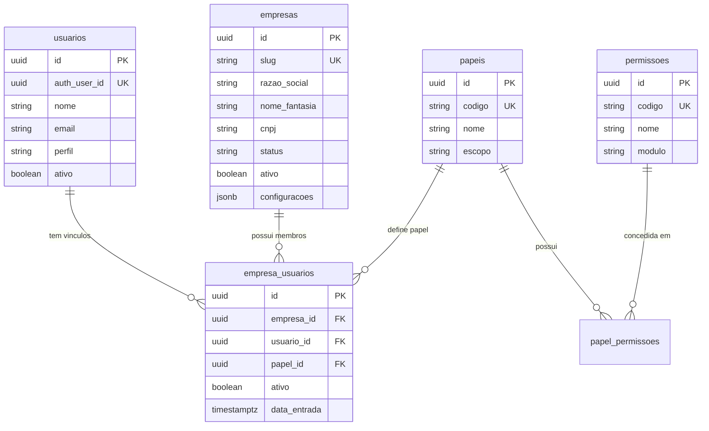

# ARQUITETURA MASTER SAAS MULTIEMPRESA — GAUCHINHO SITE

> **Versão:** 1.4.6  
> **Data de Atualização:** 09/08/2026  
> **Status da Plataforma:** Fase 2 Concluída e Homologada em Produção; **Fase 3 CONCLUÍDA E HOMOLOGADA EM PRODUÇÃO**; **Fase 4 EM ANDAMENTO** (Etapa E6 e Runtime 050 CONCLUÍDOS E HOMOLOGADOS EM PRODUÇÃO; **Migration 050 APLICADA E HOMOLOGADA COMO EXPAND**; **Runtime 050 UUID-First Corrigido e Homologado em Produção — commit `4b27374`**; **Migration 051 Contract PREPARADA LOCALMENTE (aguardando autorização para apply em banco)**; sorteios 100% inalterados; **Racon = administradora global**; **Gauchinho = empresa/franqueada**; Empresa B sem concessão; Fase 5 não iniciada)  

> **Projeto Físico:** `C:\Fernando Hugo\GAUCHINHO SITE`  
> **Repositório Git:** `https://github.com/msdfernandoh/GUACHINHO-SITE.git`

---

## 1. Visão Geral e Objetivo Arquitetural

O projeto **Gauchinho Site** está sendo transformado em uma **plataforma SaaS multiempresa de gestão e comercialização de consórcios**.

A plataforma suportará:
* **Multi-tenant (Multiempresa):** Múltiplas empresas de consórcio operando de forma isolada e segura.
* **Sites e Domínios:** Resolução de sites públicos por subdomínio, domínio customizado ou rota.
* **Branding por Empresa ou Parceiro:** Logotipos, cores, favicons, textos, menus públicos e administrativos configuráveis.
* **Catálogo Global de Administradoras:** Entidade global para administradoras (ex: Racon), compartilhando grupos e cotas habilitados por empresa.
* **Participantes Comerciais:** Vendedores, atendentes, consultores, gestores, indicadores, imobiliárias e parceiros.
* **Motor Configurável de Comissões e Repasses:** Programas de comissão da franquia por administradora, modalidade, plano e vigência.
* **Financeiro Completo e Caixa:** Separação entre parcela do cliente (paga à administradora), comissão da empresa e repasse ao participante.
* **Controle de Inadimplência e Estornos:** Políticas graduadas de estorno e compensação por parcelas pagas.

---

## 2. Princípios de Preservação e Negócio

1. **Gauchinho Consórcios como Empresa 1:** A empresa Gauchinho Consórcios é a tenant número 1 da plataforma. Todos os dados existentes (`usuarios`, `leads`, `propostas`, `grupos_consorcio`, `grupos_cotas`, `contratacoes_online`, `agenda_eventos`, `indices_financeiros`) são preservados integralmente.
2. **Padrão de Nomenclatura do Banco:** **Português snake_case** (`empresas`, `empresa_usuarios`, `papeis`, `permissoes`, `papel_permissoes`, `grupos_consorcio`, `grupos_cotas`).
3. **Identidade N:N de Usuários:** Um usuário (`public.usuarios`) pode ter vínculo ativo com uma ou mais empresas através de `public.empresa_usuarios`.
4. **Desvinculação Técnica do Consultor:** A identidade de autenticação (`auth.uid()`) se conecta a `public.usuarios.auth_user_id`. Vendas e comissões apontam para perfis operacionais de participantes/consultores (`consultant_id` / `participant_id`), nunca para `auth.uid()` diretamente.
5. **Cota Definitiva:** O número definitivo da cota nasce `NULL` e é preenchido e auditado posteriormente ao processamento da adesão pela administradora.
6. **Vagas Comerciais:** `vagas_percentual` e `vagas_texto` são parâmetros informativos da administradora, não estoque numérico decrementável.

---

## 3. Modelo Relacional e Tabelas da Fundação SaaS (Fase 1)

---

## 4. Matriz de Segurança e RLS (Row Level Security)

As funções PostgreSQL de segurança (`SECURITY DEFINER`) instaladas no banco:
* `public.current_usuario_id()`: Retorna o ID em `public.usuarios` vinculado ao `auth.uid()`.
* `public.is_platform_superadmin()`: Verifica se o usuário é `super_admin`.
* `public.is_company_member(p_empresa_id)`: Verifica se o usuário tem acesso ativo à empresa informada.
* `public.has_company_role(p_empresa_id, p_role_code)`: Verifica se o usuário possui determinado papel na empresa.

---

## 5. Mapeamento das 19 Fases de Evolução

* **FASE 0:** Auditoria Técnica e Mapeamento do Projeto *(Concluída)*
* **FASE 1:** Fundação SaaS Multiempresa (Empresas, Usuários, Papéis, Permissões, Tenant Context) *(Concluída — Migration 043)*
* **FASE 2:** Sites Multiempresa, Branding e Empresa B *(**CONCLUÍDA E HOMOLOGADA EM PRODUÇÃO** — código `12a5e61`, deploy `dpl_F1uWUw…`, docs `b3e6247`; Migration 044; Empresa B não publicada; fallback mantido temporariamente — ver `docs/relatorios-fases/FASE-02-IMPLEMENTACAO-E-HOMOLOGACAO.md`)*
* **FASE 3:** Participantes Comerciais e Sites de Parceiros *(**CONCLUÍDA E HOMOLOGADA EM PRODUÇÃO** — ver §5.1 e `docs/relatorios-fases/FASE-03-IMPLEMENTACAO-E-HOMOLOGACAO.md`)*
* **FASE 4:** Catálogo Global de Administradoras *(E0–E6 homologadas em Produção; Migrations 047–050 aplicadas; 050 homologada como expand; runtime 050 aprovado em Preview e ainda não deployado em Produção — ver §5.2 e `docs/relatorios-fases/FASE-04-CATALOGO-GLOBAL-ADMINISTRADORAS.md`)*
* **FASE 5:** Evolução de Grupos e Opções Comerciais
* **FASE 6:** CRM, Leads, Agenda e Propostas Multiempresa *(funil, distribuição, agenda, automações, histórico avançado — fora da Fase 3)*
* **FASE 7:** Contratação Online Multiempresa
* **FASE 8:** Vendas e Cota Definitiva
* **FASE 9:** Motor Configurável de Programas de Comissão
* **FASE 10:** Regras dos Participantes Comerciais
* **FASE 11:** Previsões Futuras e Cronogramas
* **FASE 12:** Competências Mensais e Inadimplência
* **FASE 13:** Recebimentos, Pagamentos e Repasses
* **FASE 14:** Estornos e Compensações
* **FASE 15:** Financeiro Completo e Caixa
* **FASE 16:** Metas, Tarefas e Equipes
* **FASE 17:** Auditoria, Relatórios e Dashboards
* **FASE 18:** Homologação Geral Integrada
* **FASE 19:** Implantação e Onboarding

---

## 5.1 FASE 3 — Escopo oficial final (documental)

> Detalhamento completo, plano E0–E10, proposta de migration 045 e critérios H1–H15:  
> `docs/relatorios-fases/FASE-03-IMPLEMENTACAO-E-HOMOLOGACAO.md`  
> **Estado:** escopo encerrado; Q1–Q5 aprovadas; sem migration/código/banco/Vercel.

### Objetivo
Entregar identidades comerciais (participantes e organizações parceiras), sites de parceiros com domínio próprio no MVP, e área comercial restrita do parceiro — sem transformar parceiro em tenant e sem redesenhar o CRM (Fase 6).

### Entregas conceituais
1. **Participantes comerciais** por `empresa_id`, tipos múltiplos, status, login opcional, auditoria.
2. **Organizações parceiras** por tenant; responsáveis = participantes; status; geo simples.
3. **Sites de parceiros** administrados **somente** pela empresa tenant (template, visual, textos, imagens, menus, domínio, DNS, publicação). Parceiro **não edita** o site.
4. **Canais do mesmo site:** `/parceiro/[slug]`, `{slug}.gauchinhoconsorcios.com.br` (sem wildcard), domínio próprio (apex+www). MVP: **≤1 site ativo por organização**.
5. **Papel** `parceiro_comercial` (novo; não reutilizar `parceiro_imobiliaria`) + permissões granulares de área comercial.
6. **Área comercial** com leitura e mutações simples no escopo da org (leads/propostas); sem Kanban/agenda/automações.
7. **Colunas nullable** em `leads`/`propostas`: `empresa_id`, `organizacao_parceira_id`, `parceiro_site_id`, `participant_id`, origem/UTMs. Legado permanece NULL; sem migrar CMS/`srd_responsavel_id` nesta fase.

### Visibilidade na área comercial
* `RESPONSAVEL_PARCEIRO` (tipo) **ou** `responsavel_principal` no vínculo: todos os leads/propostas da própria organização.
* Demais participantes autorizados: apenas vínculos próprios, salvo permissão explícita `visao_ampliada_org_parceiro`.
* Regra por **vínculo + permissão**, não só nome de perfil.
* Implementação E7: rotas `/area-parceiro/*` atrás de `FASE3_PARCEIRO_AREA_ENABLED=false`; RLS aditiva em migration **046** (**aplicada e homologada** em 2026-08-07).
* **E9 APROVADA (Preview)** e **E10 APROVADA (Produção)** em 2026-08-07: main `0b062b1`; Production final `dpl_FRwYh5gyYckM92RMyRvu736k27tE`; flags finais `AREA=true` / `PUBLIC_SITE=true` / `VERCEL_DOMAINS=false`; site homologação suspenso. Detalhe: `docs/relatorios-fases/FASE-03-IMPLEMENTACAO-E-HOMOLOGACAO.md` §24–§25.
* Status de proposta editável pelo parceiro no schema atual: `Gerada` / `PDF gerado` (equivalente conceitual a RASCUNHO; literal `RASCUNHO` não existe). Demais status (`Enviada`, `Em negociação`, `Aprovada`, `Perdida`, `Cancelada`, `Arquivada`) bloqueados por app + RLS.
* Trigger `prevent_comercial_escopo_move` impede troca de `empresa_id`/`organizacao_parceira_id` fora de staff/superadmin.

### Matriz resumida de permissões

| Capacidade | SuperAdmin / Admin empresa | `parceiro_comercial` |
|---|---|---|
| Site, branding, menus, domínio, DNS, Vercel, publicar | Sim | **Não** |
| Leads/propostas da própria org (conforme vínculo/perm) | Sim (tenant) | **Sim** |
| Leads gerais / outros parceiros / config tenant / financeiro | Sim (conforme papel) | **Não** |

### Limite explícito vs Fase 6
Fase 3 prepara chaves, isolamento e tela comercial limitada. Fase 6 evolui CRM multiempresa completo (funil, distribuição, agenda, automações, histórico avançado, captura/atribuição completa).

### Fora da Fase 3
Comissões/repasses, wildcard DNS, editor do site pelo parceiro, backfill massivo sem autorização, remoção do fallback da Fase 2, operacionalização da Empresa B, início das Fases 4+.

---

## 5.2 FASE 4 — Catálogo Global de Administradoras

> Relatório: `docs/relatorios-fases/FASE-04-CATALOGO-GLOBAL-ADMINISTRADORAS.md`  
> Branch: `feature/saas-fase-4-catalogo-administradoras` · E1 código `0a1df2e` · Migration **047 aplicada**

### Terminologia (obrigatória)
* **Racon** = **administradora global** (não é tenant).
* **Gauchinho Consórcios** = **empresa / franqueada / tenant** credenciada da Racon.
* **Empresa B** = outro tenant SaaS (`em_treinamento`).
* **`empresa_administradoras`** = concessão Superadmin empresa×administradora — **não** transforma a empresa em administradora.
* Parceiros/consultores/leads/propostas pertencem ao **tenant** (ex.: Gauchinho), não à administradora.

### Decisões centrais
* Administradora = entidade **global** da plataforma.
* Concessão `empresa × administradora` **somente** por `PLATFORM_SUPERADMIN`.
* Tenant **não** escolhe nem descobre administradoras não autorizadas.
* Comissões/repasses **não** pertencem ao catálogo global.

### E1 — Fundação (**APLICADA E HOMOLOGADA**)
* Migration `047_fase4_catalogo_global_administradoras.sql` — **001–047** local=remote; dry-run up to date
* `administradoras` + `empresa_administradoras` (RLS só Superadmin na E1)
* `grupos_consorcio.administradora_id` nullable; **0** backfill; texto legado intacto
* Racon global `c5f8ecb4-cb5a-5014-b567-50484719b404` (`racon`/`ATIVA`)
* Concessão: empresa Gauchinho `7170f38e-…` → Racon `ATIVA`; Empresa B → 0
* Homologação: 21/21 RLS/constraints; npm 487; build 0; smoke `/grupos`+`/simulador` 200

### E2 — Libs de autorização (remoto `5fb3b07`)
* Módulo: `gauchinho-app/src/lib/administradoras/`
* Global Superadmin vs autorizada por empresa/franqueada; erro `NOT_FOUND` uniforme
* Service role só após assert de sessão; sem cache; sem migration 048

### E3 — Admin global Superadmin (remoto `3ecd168`)
* Rotas: `/admin/administradoras`, `/nova`, `/[id]`
* Menu só Superadmin: **Catálogo de Administradoras**
* Mutations + `audit_logs` (`ADMINISTRADORA_GLOBAL_*`); soft status ATIVA/INATIVA; sem DELETE
* Gauchinho listado só como empresa/franqueada vinculada; Empresa B sem concessão nova

### E4 — Concessões por empresa (remoto `0580329`)
* Seção **Administradoras autorizadas** em `/admin/empresas/[id]` (somente PLATFORM_SUPERADMIN)
* Serviços: `grantAdministradoraToEmpresa` / `updateEmpresaAdministradora` / `setEmpresaAdministradoraStatus` / `getEmpresaAdministradorasForSuperadmin`
* Status vínculo ATIVA/INATIVA/SUSPENSA; campos locais (códigos/contato/observações); sem DELETE; sem secrets UI
* Audit: `EMPRESA_ADMINISTRADORA_CONCEDIDA|ATUALIZADA|STATUS_ALTERADO`
* Gauchinho→Racon ATIVA preservada; Empresa B continua **0** concessões

### E5 — Backfill/adapters grupos (**APLICADA E HOMOLOGADA** · remoto `33b6b2d`)
* Migration `048_fase4_backfill_grupos_administradora_id.sql` (SHA256 `FA9574A0…DABA`) **aplicada**
* 19/19 grupos com `administradora_id` = Racon (`c5f8ecb4-…`); texto RACON×16 / Racon×3 **preservado**
* 178 cotas / 16 propostas / 18 contratações / 10 simulações / 31 modalidades intactos
* Adapters + dual-write `/admin/grupos`; Empresa B continua **0** concessões
* **E6 (hardening pré-049):** sorteios público tenant-scoped; testes mock pós-049; integração Gauchinho legado documentada; cartas = proposta **050**
* **001–048** local=remote; dry-run: **Would push only 049**

### Etapa 050 — cartas contempladas
* Branch: `feature/saas-fase-4-cartas-confidencialidade`; runtime corrigido `a416e85`.
* Preview `dpl_HHrjVRgfYwhNhB3Jveofd6e2i6A6` READY e homologado novamente com schema remoto 050.
* Runtime compatível pré/pós-050: Host resolve tenant; concessão + administradora global devem estar ATIVA; UUID e snapshot textual suportam transição segura.
* Migration 050 aplicada como expand aditiva: FK UUID nullable `ON DELETE SET NULL`, índice e 4/4 cartas backfilladas para Racon; snapshot `RACON` preservado.
* A 050 **não remove** `cartas_public_read`; SELECT anon direto de quatro cartas continua como acesso legado temporário esperado.
* Contract RLS deve ocorrer em migration posterior somente após runtime novo em Produção.

### Status etapas
E0–E6 HOMOLOGADAS EM PRODUÇÃO · MIGRATION 050 APLICADA/HOMOLOGADA COMO EXPAND · RUNTIME 050 APROVADO EM PREVIEW E NÃO DEPLOYADO EM PRODUÇÃO · 051 NÃO CRIADA · E7–E9 NÃO INICIADAS · Fase 4 EM ANDAMENTO · Fase 5 NÃO INICIADA

### Riscos atuais
* MÉDIA: `cartas_public_read` ainda permite leitura anon direta até o contract pós-runtime.
* REGISTRO TÉCNICO NÃO ACIONÁVEL NA FASE 4: `grupos_sorteios_loteria_public_read` expõe nome/e-mail autoral, mas o comportamento foi aprovado pelo proprietário e não é requisito, bloqueante ou tarefa da 050/051; sorteios devem permanecer inalterados.
* BAIXA: alteração de slug global permitida (auditada) — impacto futuro em URLs.
