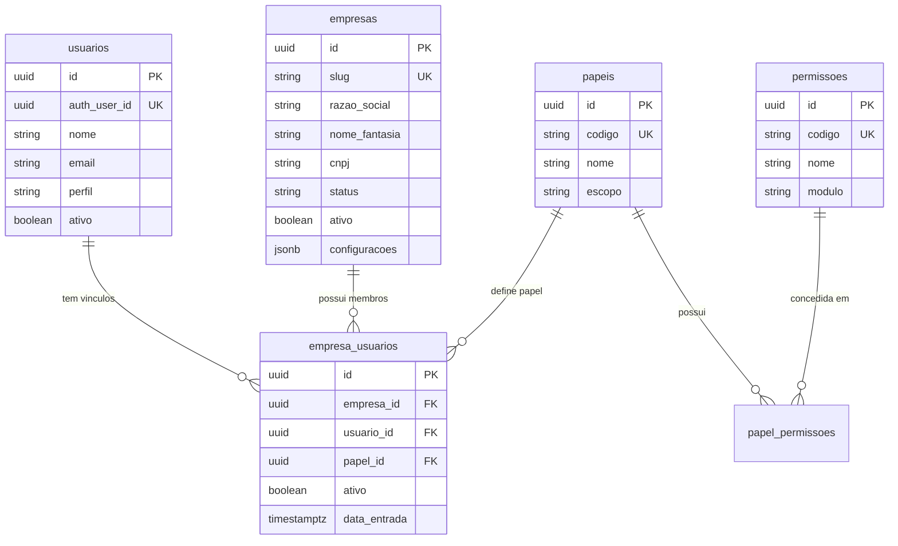

# ARQUITETURA MASTER SAAS MULTIEMPRESA — GAUCHINHO SITE

> **Versão:** 1.2.1  
> **Data de Atualização:** 07/08/2026  
> **Status da Plataforma:** Fase 2 Concluída e Homologada em Produção; Fase 3 escopo oficial final (§5.1); migration 045 **aplicada e homologada**; E0–E4 implementados (admin participantes/orgs/sites sob flags off); sem Vercel/DNS/site público/área comercial/deploy/merge main nesta rodada  

> **Projeto Físico:** `C:\Fernando Hugo\GAUCHINHO SITE`  
> **Repositório Git:** `https://github.com/msdfernandoh/GUACHINHO-SITE.git`

---

## 1. Visão Geral e Objetivo Arquitetural

O projeto **Gauchinho Site** está sendo transformado em uma **plataforma SaaS multiempresa de gestão e comercialização de consórcios**.

A plataforma suportará:
* **Multi-tenant (Multiempresa):** Múltiplas empresas de consórcio operando de forma isolada e segura.
* **Sites e Domínios:** Resolução de sites públicos por subdomínio, domínio customizado ou rota.
* **Branding por Empresa ou Parceiro:** Logotipos, cores, favicons, textos, menus públicos e administrativos configuráveis.
* **Catálogo Global de Administradoras:** Entidade global para administradoras (ex: Racon), compartilhando grupos e cotas habilitados por empresa.
* **Participantes Comerciais:** Vendedores, atendentes, consultores, gestores, indicadores, imobiliárias e parceiros.
* **Motor Configurável de Comissões e Repasses:** Programas de comissão da franquia por administradora, modalidade, plano e vigência.
* **Financeiro Completo e Caixa:** Separação entre parcela do cliente (paga à administradora), comissão da empresa e repasse ao participante.
* **Controle de Inadimplência e Estornos:** Políticas graduadas de estorno e compensação por parcelas pagas.

---

## 2. Princípios de Preservação e Negócio

1. **Gauchinho Consórcios como Empresa 1:** A empresa Gauchinho Consórcios é a tenant número 1 da plataforma. Todos os dados existentes (`usuarios`, `leads`, `propostas`, `grupos_consorcio`, `grupos_cotas`, `contratacoes_online`, `agenda_eventos`, `indices_financeiros`) são preservados integralmente.
2. **Padrão de Nomenclatura do Banco:** **Português snake_case** (`empresas`, `empresa_usuarios`, `papeis`, `permissoes`, `papel_permissoes`, `grupos_consorcio`, `grupos_cotas`).
3. **Identidade N:N de Usuários:** Um usuário (`public.usuarios`) pode ter vínculo ativo com uma ou mais empresas através de `public.empresa_usuarios`.
4. **Desvinculação Técnica do Consultor:** A identidade de autenticação (`auth.uid()`) se conecta a `public.usuarios.auth_user_id`. Vendas e comissões apontam para perfis operacionais de participantes/consultores (`consultant_id` / `participant_id`), nunca para `auth.uid()` diretamente.
5. **Cota Definitiva:** O número definitivo da cota nasce `NULL` e é preenchido e auditado posteriormente ao processamento da adesão pela administradora.
6. **Vagas Comerciais:** `vagas_percentual` e `vagas_texto` são parâmetros informativos da administradora, não estoque numérico decrementável.

---

## 3. Modelo Relacional e Tabelas da Fundação SaaS (Fase 1)

---

## 4. Matriz de Segurança e RLS (Row Level Security)

As funções PostgreSQL de segurança (`SECURITY DEFINER`) instaladas no banco:
* `public.current_usuario_id()`: Retorna o ID em `public.usuarios` vinculado ao `auth.uid()`.
* `public.is_platform_superadmin()`: Verifica se o usuário é `super_admin`.
* `public.is_company_member(p_empresa_id)`: Verifica se o usuário tem acesso ativo à empresa informada.
* `public.has_company_role(p_empresa_id, p_role_code)`: Verifica se o usuário possui determinado papel na empresa.

---

## 5. Mapeamento das 19 Fases de Evolução

* **FASE 0:** Auditoria Técnica e Mapeamento do Projeto *(Concluída)*
* **FASE 1:** Fundação SaaS Multiempresa (Empresas, Usuários, Papéis, Permissões, Tenant Context) *(Concluída — Migration 043)*
* **FASE 2:** Sites Multiempresa, Branding e Empresa B *(**CONCLUÍDA E HOMOLOGADA EM PRODUÇÃO** — código `12a5e61`, deploy `dpl_F1uWUw…`, docs `b3e6247`; Migration 044; Empresa B não publicada; fallback mantido temporariamente — ver `docs/relatorios-fases/FASE-02-IMPLEMENTACAO-E-HOMOLOGACAO.md`)*
* **FASE 3:** Participantes Comerciais e Sites de Parceiros *(Escopo oficial **final** documental — ver §5.1 e `docs/relatorios-fases/FASE-03-IMPLEMENTACAO-E-HOMOLOGACAO.md`; **implementação não iniciada**)*
* **FASE 4:** Catálogo Global de Administradoras
* **FASE 5:** Evolução de Grupos e Opções Comerciais
* **FASE 6:** CRM, Leads, Agenda e Propostas Multiempresa *(funil, distribuição, agenda, automações, histórico avançado — fora da Fase 3)*
* **FASE 7:** Contratação Online Multiempresa
* **FASE 8:** Vendas e Cota Definitiva
* **FASE 9:** Motor Configurável de Programas de Comissão
* **FASE 10:** Regras dos Participantes Comerciais
* **FASE 11:** Previsões Futuras e Cronogramas
* **FASE 12:** Competências Mensais e Inadimplência
* **FASE 13:** Recebimentos, Pagamentos e Repasses
* **FASE 14:** Estornos e Compensações
* **FASE 15:** Financeiro Completo e Caixa
* **FASE 16:** Metas, Tarefas e Equipes
* **FASE 17:** Auditoria, Relatórios e Dashboards
* **FASE 18:** Homologação Geral Integrada
* **FASE 19:** Implantação e Onboarding

---

## 5.1 FASE 3 — Escopo oficial final (documental)

> Detalhamento completo, plano E0–E10, proposta de migration 045 e critérios H1–H15:  
> `docs/relatorios-fases/FASE-03-IMPLEMENTACAO-E-HOMOLOGACAO.md`  
> **Estado:** escopo encerrado; Q1–Q5 aprovadas; sem migration/código/banco/Vercel.

### Objetivo
Entregar identidades comerciais (participantes e organizações parceiras), sites de parceiros com domínio próprio no MVP, e área comercial restrita do parceiro — sem transformar parceiro em tenant e sem redesenhar o CRM (Fase 6).

### Entregas conceituais
1. **Participantes comerciais** por `empresa_id`, tipos múltiplos, status, login opcional, auditoria.
2. **Organizações parceiras** por tenant; responsáveis = participantes; status; geo simples.
3. **Sites de parceiros** administrados **somente** pela empresa tenant (template, visual, textos, imagens, menus, domínio, DNS, publicação). Parceiro **não edita** o site.
4. **Canais do mesmo site:** `/parceiro/[slug]`, `{slug}.gauchinhoconsorcios.com.br` (sem wildcard), domínio próprio (apex+www). MVP: **≤1 site ativo por organização**.
5. **Papel** `parceiro_comercial` (novo; não reutilizar `parceiro_imobiliaria`) + permissões granulares de área comercial.
6. **Área comercial** com leitura e mutações simples no escopo da org (leads/propostas); sem Kanban/agenda/automações.
7. **Colunas nullable** em `leads`/`propostas`: `empresa_id`, `organizacao_parceira_id`, `parceiro_site_id`, `participant_id`, origem/UTMs. Legado permanece NULL; sem migrar CMS/`srd_responsavel_id` nesta fase.

### Visibilidade na área comercial
* `RESPONSAVEL_PARCEIRO`: todos os leads/propostas da própria organização.
* Demais participantes autorizados: apenas vínculos próprios, salvo permissão de visão ampliada na org.
* Regra por **vínculo + permissão**, não só nome de perfil.

### Matriz resumida de permissões

| Capacidade | SuperAdmin / Admin empresa | `parceiro_comercial` |
|---|---|---|
| Site, branding, menus, domínio, DNS, Vercel, publicar | Sim | **Não** |
| Leads/propostas da própria org (conforme vínculo/perm) | Sim (tenant) | **Sim** |
| Leads gerais / outros parceiros / config tenant / financeiro | Sim (conforme papel) | **Não** |

### Limite explícito vs Fase 6
Fase 3 prepara chaves, isolamento e tela comercial limitada. Fase 6 evolui CRM multiempresa completo (funil, distribuição, agenda, automações, histórico avançado, captura/atribuição completa).

### Fora da Fase 3
Comissões/repasses, wildcard DNS, editor do site pelo parceiro, backfill massivo sem autorização, remoção do fallback da Fase 2, operacionalização da Empresa B, início das Fases 4+.
